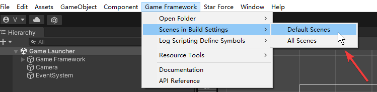

1. Execute injector
```shell
injector.bat <Target Project Path>
```
2. Set ENABLE_LOG in PlayerSetting:

3. Add Scenes:


4. Set Version in '0.1.0'

Resolve Error (Optional)

Add Layer *Targetable Object*


# Build in Command Line 
Cmd :
```shell
"C:\Program Files\Unity\Hub\Editor\2021.3.7f1c1\Editor\Unity.exe" -quit -batchmode -logFile mybuild.log -projectPath d:\git\client.tob.true.ly\code\GameFrameworkInjector\Cap1\ -executeMethod UnityGameFramework.Editor.ResourceTools.ResourceBuilder.CmdBuild
```
Output:
```shell
file:///D:/output/StarForceAssetBundle/Full/0_1_0_22/AndroidVersion.txt
```

# Build WebGL
1. Change IP address you wanted.
    ```
    Assets/GameMain/Configs/BuildInfo.txt
    Assets/GameMain/Configs/CheckVersionTemplate.txt
    ```
2. Build Resource (GameFramework Resource Builder). Output path:
    ```
    D:\ftp\build_output\webgl\Cap1AssetBundle
    ```
    * Should check WebGL in **Platforms** section.
3. Build WebGL package (Unity build setting). Output path:
    ```
    D:\ftp\build_output\webgl\Cap1
    ```
4. Visit from URL.
    * Web server root:
    ```
    D:\ftp\build_output
    ```
    * Tomcat conf (server.xml)
    ```xml
    <Host name="localhost"  appBase="webapps"
            unpackWARs="true" autoDeploy="true">

        <!-- SingleSignOn valve, share authentication between web applications
             Documentation at: /docs/config/valve.html -->
        <!--
        <Valve className="org.apache.catalina.authenticator.SingleSignOn" />
        -->

        <!-- Access log processes all example.
             Documentation at: /docs/config/valve.html
             Note: The pattern used is equivalent to using pattern="common" -->
        <Valve className="org.apache.catalina.valves.AccessLogValve" directory="logs"
               prefix="localhost_access_log" suffix=".txt"
               pattern="%h %l %u %t &quot;%r&quot; %s %b" />

		<Context path="" docBase="D:/ftp/build_output/" debug="0" reloadable="true" crossContext="true" />

      </Host>
    ```
    * URL
    ```
    http://10.60.81.220:8080/webgl/Cap1/index.html
    ```
    * Should use same IP Address in *BuildInfo.txt* to visit in URL. If not, it will be fault. For example:
        Visit via:
        ```
        http://127.0.0.1:8080/webgl/Cap1/index.html
        ```
        
4. Update version
    Just execute GF Resource Builder only.
    And Refresh Web Browser again.
