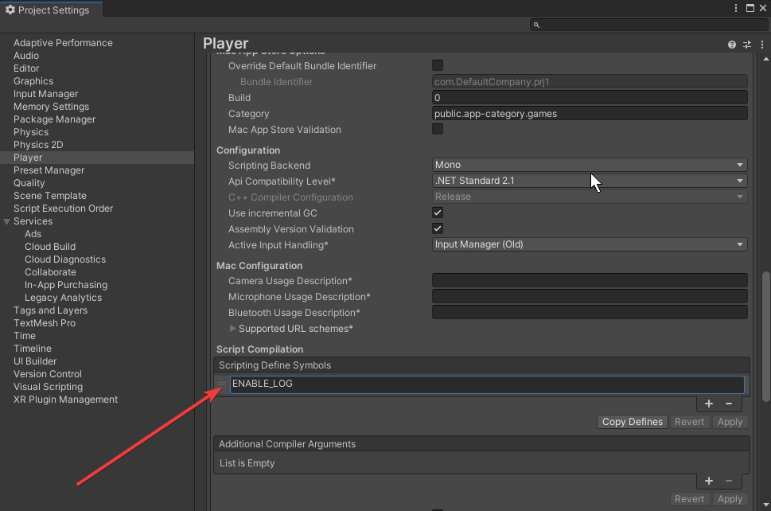
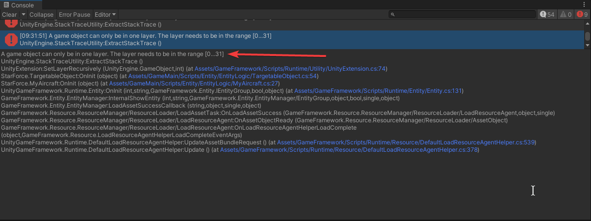
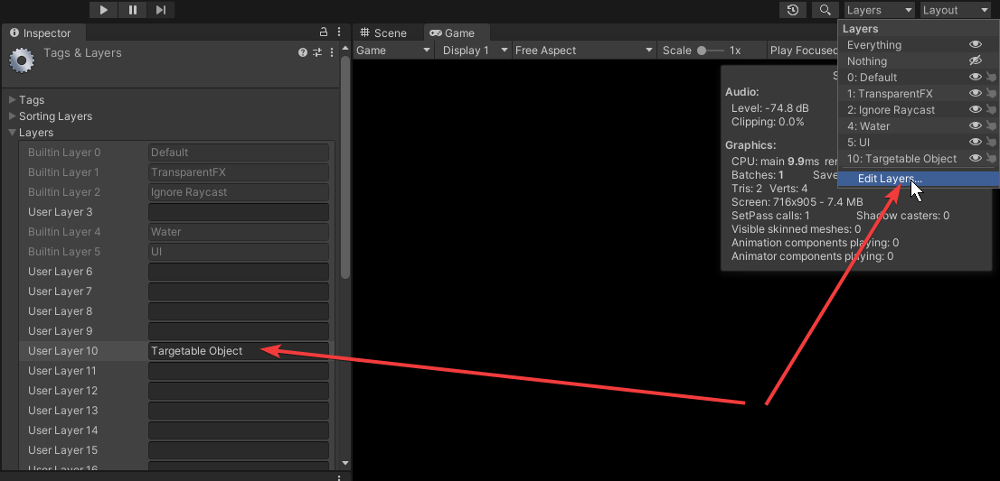

1. Execute injector
```shell
injector.bat <Target Project Path>
```
2. Set ENABLE_LOG in PlayerSetting:

3. Add Scenes:


4. Set Version in '0.1.0'

Resolve Error (Optional)

Add Layer *Targetable Object*


# Build in Command Line 
Cmd :
```shell
"C:\Program Files\Unity\Hub\Editor\2021.3.7f1c1\Editor\Unity.exe" -quit -batchmode -logFile mybuild.log -projectPath d:\git\client.tob.true.ly\code\GameFrameworkInjector\Cap1\ -executeMethod UnityGameFramework.Editor.ResourceTools.ResourceBuilder.CmdBuild
```
Output:
```shell
file:///D:/output/StarForceAssetBundle/Full/0_1_0_22/AndroidVersion.txt
```