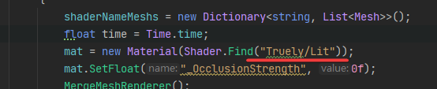
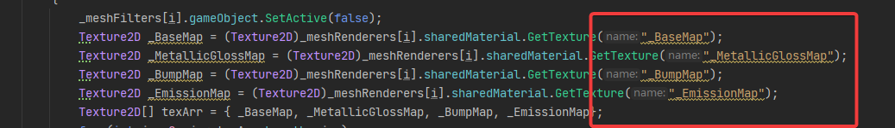
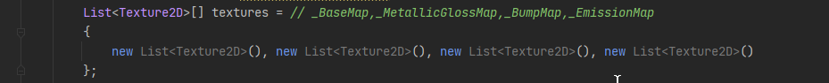
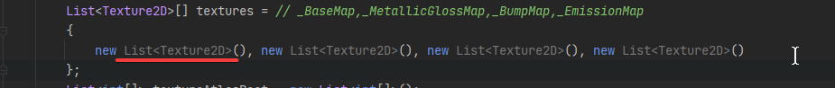
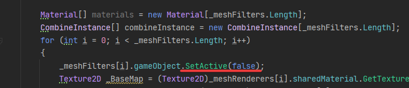
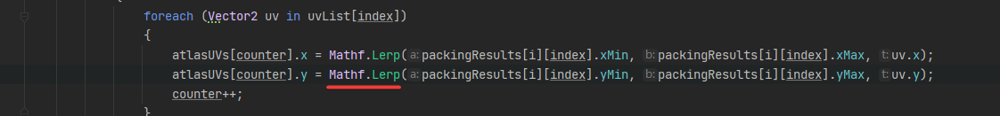
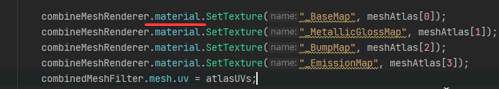
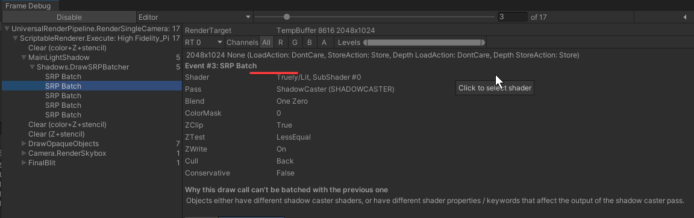
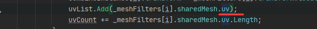

# MergeMeshTexture
## Experience

## Quetion
* Open parameters for adaptability:
    * 
    * 
    * 
* Change to *Dictionary*:
    * 
* List -> Array
    * 
* Delay to loop ending and SetActive(false) just once.
    * 
* Limitation of *Wrap Mode*
    * 
* How about multiple materials?
    * 
* SRP batch lost some draw call in shadow.
    * 
* How about other uvs?
    * 
 
## Todo
* Test memory leaking.
* Test launching time on mobile.
