# Download GitHubDesktop
[Internal Network](http://10.60.80.2:8099/ftp/tools/GitHubDesktopSetup-x64.exe)
[Official](https://desktop.github.com/)

# Install GitHubDesktop
1. Download [URL](http://10.60.80.2:8099/ftp/tools/GitHubDesktopSetup-x64.exe)
2. Install

# Get git lib URL
1. Visit [Gitblit](http://10.60.80.2:10101/)
    * Get account and password from programmer at first.
2. Find repository you want. And click it.
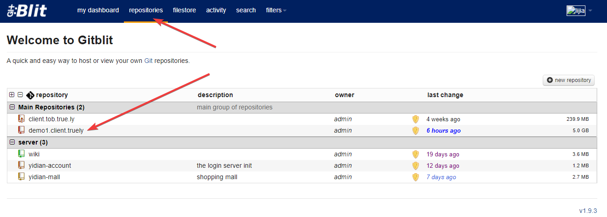
3. Click URL. If you want to fill repository URL by yourself, copy it and jump to next phrase.
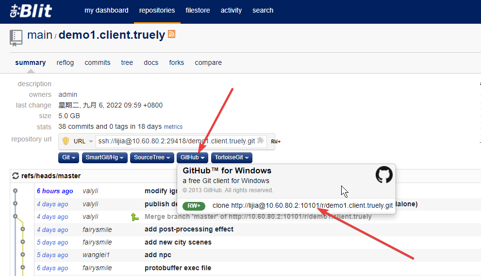
4. To open GitHubDesktop.
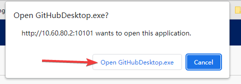
5. Git URL will be filled automatically. Click clone button to check out repository.
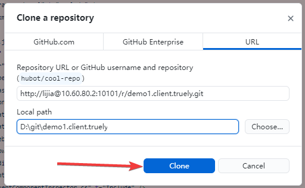
5. Wait until finished, you could see the history of repository.
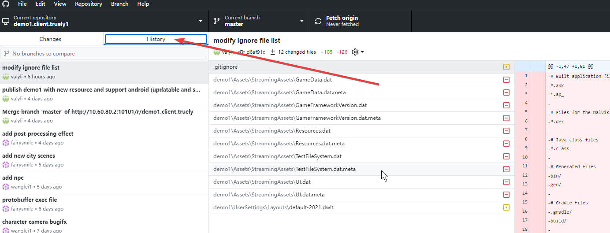


# Fill repository URL by yourself
If you Web Browser can not open GitHub automatically at before. You could follow next steps to clone git repository.
If already cloned git repository, skip this step.
1. Choose clone from menu.
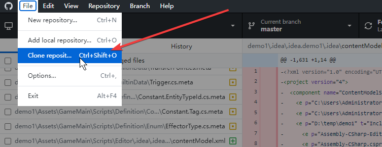
2. Fill URL.  Local path will be filled automatically.


# Install Git
1. Download and install.
    [Git-2.30.2-64-bit.exe](http://10.60.80.2:8099/ftp/tools/Git-2.30.2-64-bit.exe)
2. Press Next buttons to the end in install wizard.
3. Press Win + R, and Input **cmd** and press Return key.
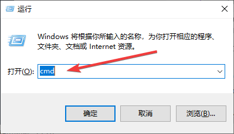
4. Input command to check Git version.
```shell
git --version
```
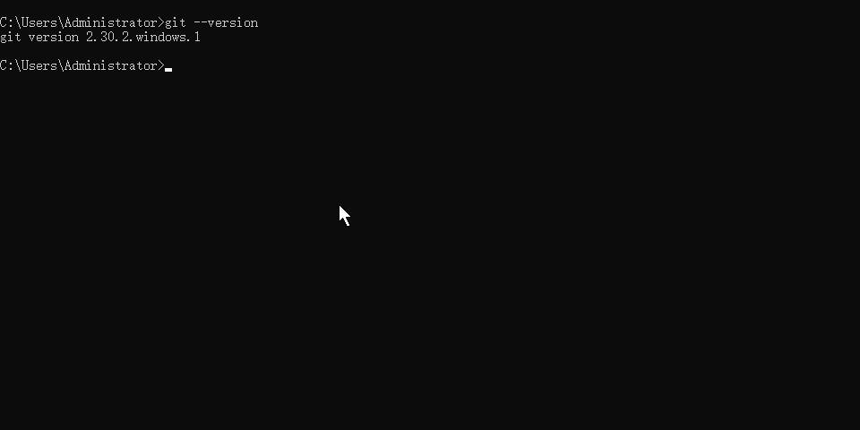

# Set line separator (Important)
1. Press Win + R, and Input **cmd** and press Return key.
2. Input command and run.
    a. On Windows:
    ```shell
    git config --global core.autocrlf true
    ```
    b. On Mac:
    ```shell
    git config --global core.autocrlf input
    ```

# Pull
Click this button
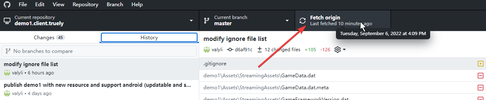
* You could pull new commits from remote server everytime you want.

# Commit
1. Select files want to commit.
2. You could see the change of this file in the right section.
3. Write comment of this commit.
3. Click commit button.
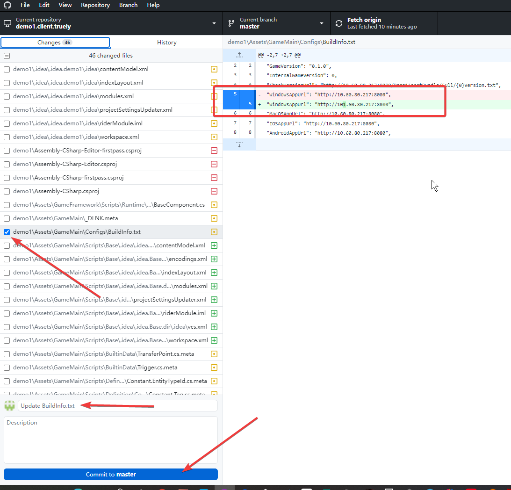
Another sample:
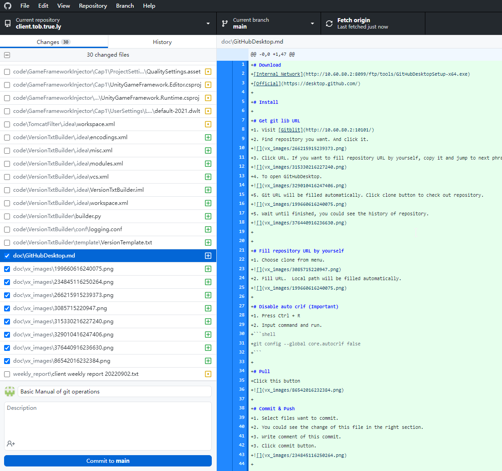

# Push
1. Click History label, could see which commits wait to push.
2. Click the push button.
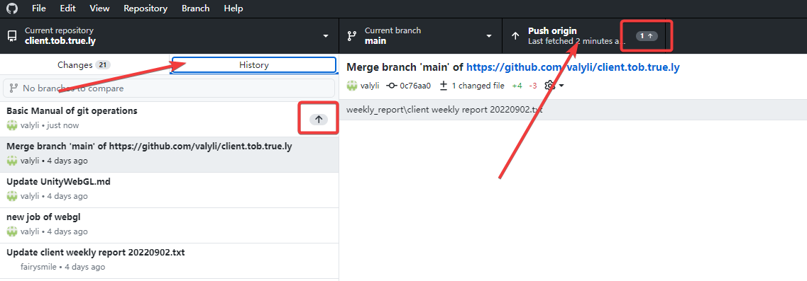
* Sometimes it will pull new commits from others first.
* If others modify the same file with you and commit before than yours. You will see a merge log. It is normal workflow, do not worry about that.


# Attention
* If you meet **conflict**, call programmer to help you resolve it.
* Never do **revert** or **reset**. If you want to do that, call a programmer to do with you together. This is a danger-operation.

# Refer
* Why should commit .meta? [ref](https://blog.csdn.net/u012169685/article/details/46378993)
* Why should disable autocrlf? [ref1](https://blog.csdn.net/u013037336/article/details/121541008)  [ref2](https://markentier.tech/posts/2021/10/autocrlf-true-considered-harmful/) [ref3](https://blog.csdn.net/weixin_41056807/article/details/114368489)
