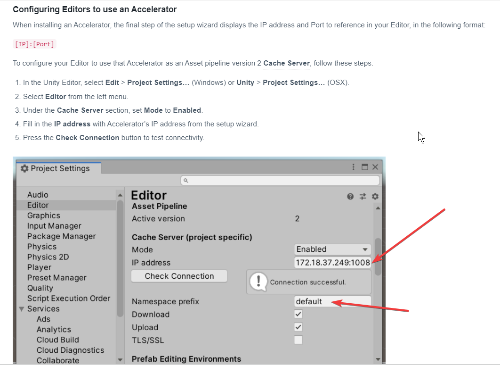

# Computer Infomation
IP: 10.60.80.2
Location: B-12-1
CPU: i7-9700
MEM: 16GB
DISK: C(SSD 256G) D(HD 1T)
It is property of Xing Chong.

Administrator
Abc$1234

# FTP
FileZilla Server

* Location root:
```shell
D:\ftp
```
|   Sub path   |     Purpose     |
| ------------ | --------------- |
| build_output | Jenkins outputs |
| doc          | Documents       |
| tools        | Tools           |

* Visit method 1:
ftp://10.60.80.2:21
username: download
password: 

* Visit method 2:
http://10.60.80.2:8099/ftp/

# Http 
http://10.60.80.2:8099

| Sub path (Remote) |                                 Sub path (Location)                                 |           Purpose           |
| ----------------- | ----------------------------------------------------------------------------------- | --------------------------- |
| /jenkins/git/     | C:\Users\Administrator\AppData\Local\Jenkins\.jenkins\workspace\build_demo1_andorid | git repository              |
| /ftp/             | D:\ftp                                                                              | download ftp files via http |

# Redmine
http://10.60.80.2:8077/redmine/
admin
Abc$1234

# Jenkins
http://localhost:8088/
admin
Abc$1234

# Gitblit
http://10.60.80.2:10101/repositories/
D:\soft\gitblit-1.9.3

# SVN
VisualSVN
https://10.60.80.2:456
http://10.60.80.2:8099/ftp/tools/TortoiseSVN-1.14.3.29387-x64-svn-1.14.2.msi

# JDK & JRE
D:\Program Files\Java
| Version    | Purpose    |
| --- | --- |
| jdk1.8.0_45    |     |
| jdk1.8.0_45    |  For Tomcat 9   |
| jdk1.8.0_45    |     |

# Untiy Accelerator
[metrics-page](http://10.60.80.2/dashboard/#/metrics-page)
10.60.80.2:10080

admin
Abc$1234