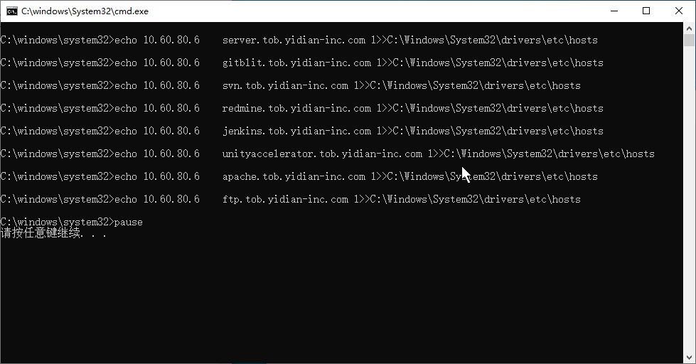
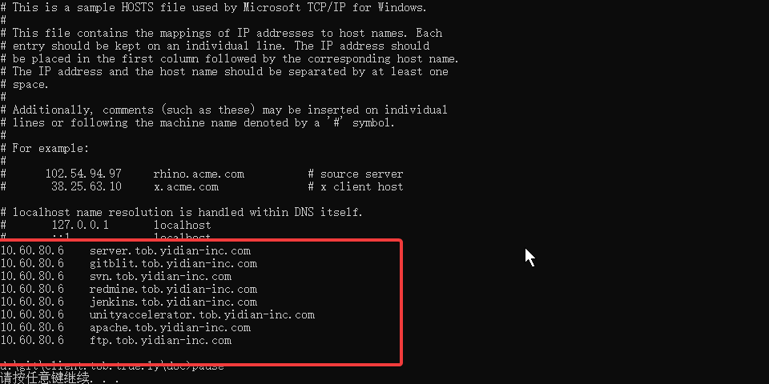

# Set Domains In Local Host

* Download: [http://10.60.80.6:8099/ftp/tools/localhost/inject_hosts.bat](http://10.60.80.6:8099/ftp/tools/localhost/inject_hosts.bat)
* Run this file.
    

## Check Current Local Host
* Download: [http://10.60.80.6:8099/ftp/tools/localhost/show_hosts.bat](http://10.60.80.6:8099/ftp/tools/localhost/show_hosts.bat)
* Run this file.

* It is already if show the result as above. 
