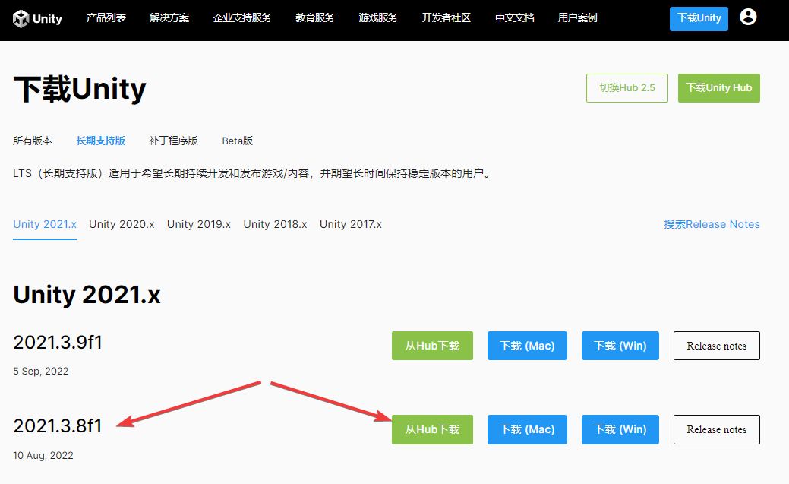
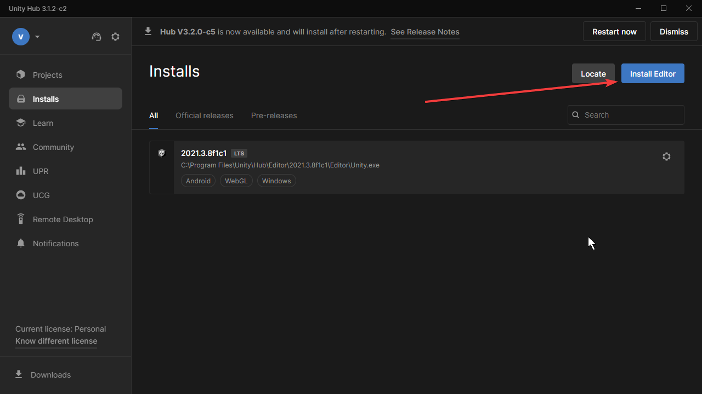
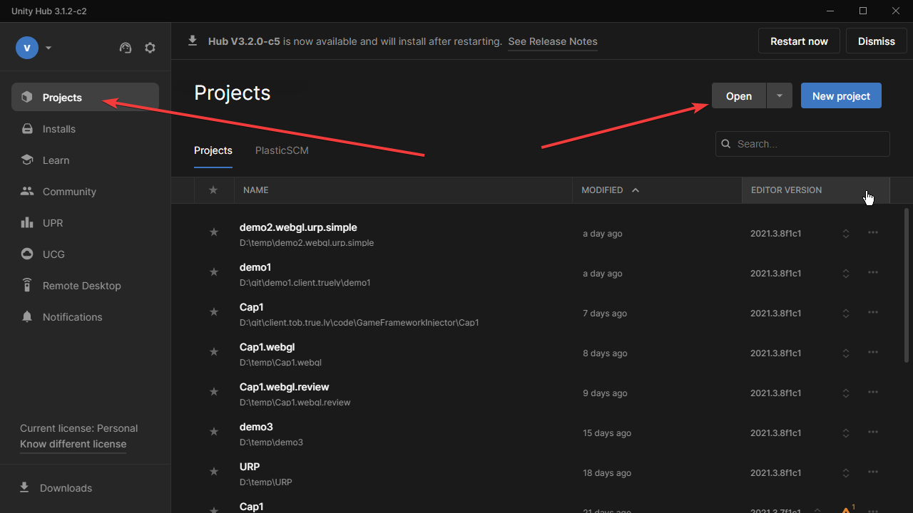
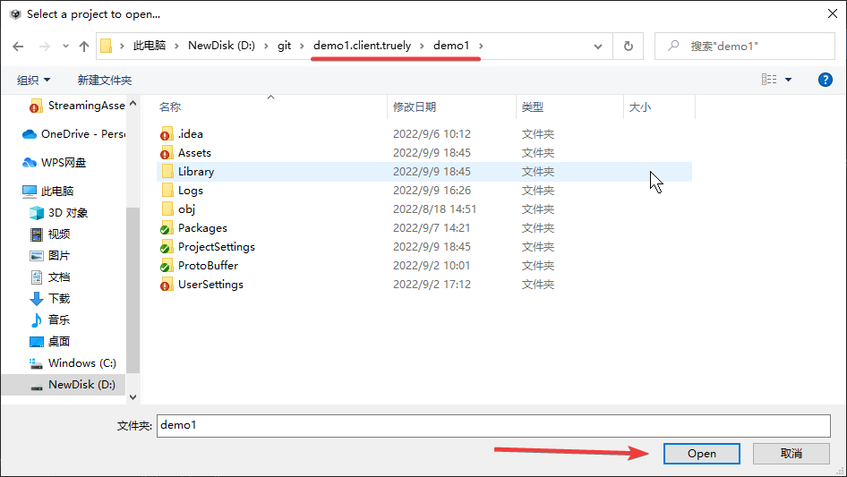
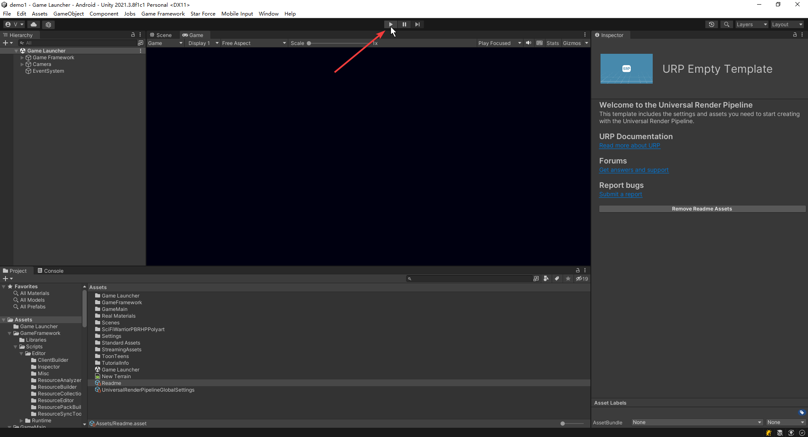
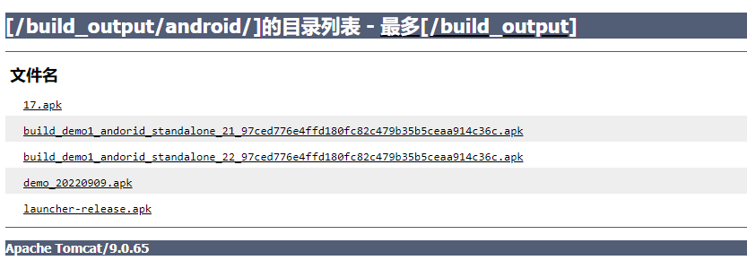
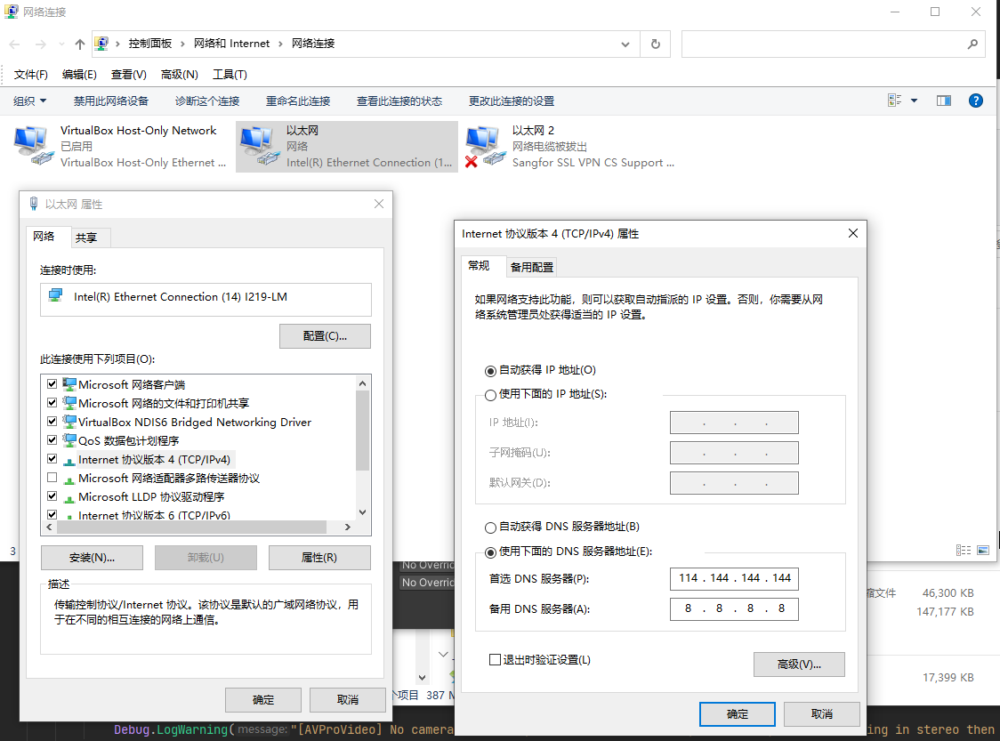

# Download & Install Unity Hub
[2021](https://unity.cn/releases/lts/2021)
Version: 2021.3.8f1

# Download & Install Unity

# Open Unity Project
1. Select Project label and click Open button.

2. Select Unity project directory and open.

# Play Game 

# Download Android Install Package (APK)
[website](http://10.60.80.2:8099/ftp/build_output/android/)

# Fix DNS
DNS of company will forbidden Android Checking at package building.
