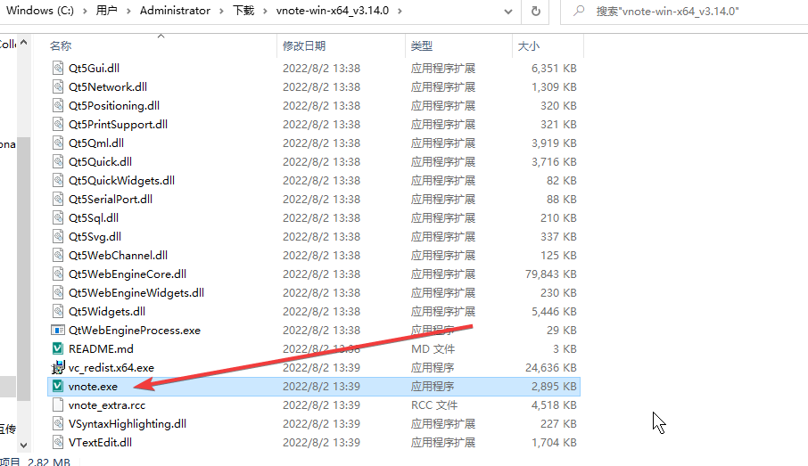

# Why?
We write docments in *Markdown* format at all.
*Vnote* is a good editor for this format, and it is an open-source project.

# Download
[http://10.60.80.6:8099/ftp/tools/vnote-win-x64_v3.14.0.zip](http://10.60.80.6:8099/ftp/tools/vnote-win-x64_v3.14.0.zip)
[http://http.tob.yidian-inc.com:8099/ftp/tools/vnote-win-x64_v3.14.0.zip](http://http.tob.yidian-inc.com:8099/ftp/tools/vnote-win-x64_v3.14.0.zip)

# Unzip & Run
