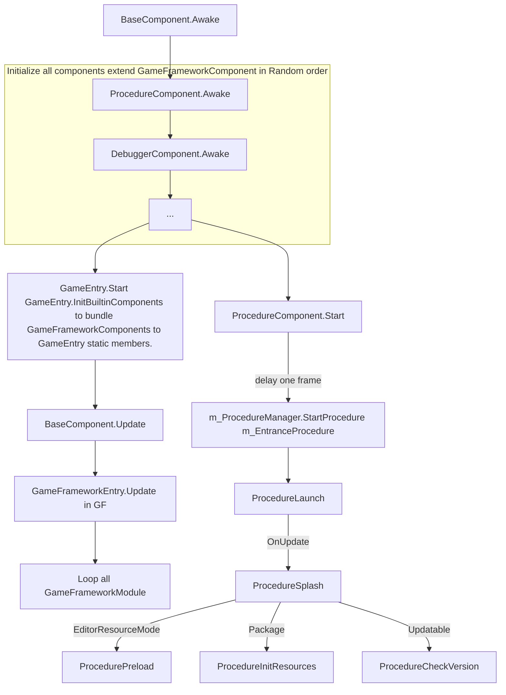

[Simeple Introduce](https://www.233tw.com/unity/49968)  
[Official](https://gameframework.cn/)  
[FAQ](https://gameframework.cn/faq/)  
[API Reference](https://gameframework.cn/api/index.html)  
[video tutorial](https://www.bilibili.com/video/BV1sE411C7cu?spm_id_from=333.337.search-card.all.click)

# Github
[GameFramework](https://github.com/EllanJiang/GameFramework)  
[UnityGameFramework](https://github.com/EllanJiang/UnityGameFramework.git)  
[StarForce(Demo Project)](https://github.com/EllanJiang/StarForce)  


# Goal
User Guide
Code anlysis(Debug)
Inspector useage
Code standard

# Code standard
* Member's name start with **m_**
* Static memeber's name start with **s_**

# Common
## FsmState<T>
|Attributes                   |                                 |
|:----------------------------|:---------------------------------|
|Namespace                    |GF                              |
|Hierarchy                    ||

|Funtions                     |                                 |
|:----------------------------|:---------------------------------|
|ChangeState()                |Invoke OnLeave() and OnEnter() internally. |
* Could improve: Add changing conditions to check validity of changing rule.


# Game Entry Flow
## BaseComponent
|Attributes                   |                                 |
|:----------------------------|:---------------------------------|
|Namespace                    |UGF                              |
|Hierarchy                    |GameFrameworkComponent : MonoBehaviour|

|Funtions                     |                                 |
|:----------------------------|:---------------------------------|
|Awake()                      |**[step 1]** First entry of GameFramework. Initialize Utilites, helpers and so on.  And RegisterComponent() |

Attached to **Builtin** node.
Component name set with :
```csharp
[AddComponentMenu("Game Framework/Base")]
```

## GameEntry (UGF)
|Attributes                   |                                 |
|:----------------------------|:---------------------------------|
|Namespace                    |Game                              |
|Hierarchy                    |MonoBehaviour|

Use GameEntry as a static class to simplify invoking and reduce cost of looping in GetComponent(). Example:
```csharp
(ProcedureBase)GameEntry.Procedure.CurrentProcedure
```
Files:
```
\StarForce\Assets\GameFramework\Scripts\Runtime\Base\GameEntry.cs
\StarForce\Assets\GameMain\Scripts\Base\GameEntry.cs
\StarForce\Assets\GameMain\Scripts\Base\GameEntry.Builtin.cs
\StarForce\Assets\GameMain\Scripts\Base\GameEntry.Custom.cs
```

## Flow chart

GameFramework can not promise order of:
> GameFrameworkComponent in GameEntry.s_GameFrameworkComponents
GameFrameworkModule in GameFrameworkEntry.s_GameFrameworkModules

Because of :
> * All **GameFrameworkComponent** will register self in **Awake** with GameEntry.RegisterComponent(this)
> * All **GameFrameworkModule** will be created by GameFrameworkEntry.GetModule() at **first invoked**.
>   ```csharp
>   // Rule of module name.
>   string moduleName = Utility.Text.Format("{0}.{1}", interfaceType.Namespace, interfaceType.Name.Substring(1));
>   Type moduleType = Type.GetType(moduleName);
>   ```
> * The order that Unity calls each GameObject's Awake is not deterministic. [ref](https://docs.unity3d.com/ScriptReference/MonoBehaviour.Awake.html)

Attention:
>* Not recommend to set Awake order. (Edit>Project Settings>Script Execution Order)
>* Modify order of **GameFrameworkModule** by **Priority** in it.


# ...Helper
## DefaultTextHelper (UGF)
Use StringBuilder & cache it to reduce memory allocations.

# GameFrameworkComponent (UGF)
class GameFrameworkComponent : MonoBehaviour

## ConfigComponent (UGF)
|Attributes                   |                                 |
|:----------------------------|:---------------------------------|
|Namespace                    |UnityGameFramework.Runtime        |
|Hierarchy                    |GameFrameworkComponent|

Use ConfigComponent as a Component to simplify reading config information. Example:
```csharp
ConfigComponent Config = GameEntry.GetComponent<ConfigComponent>()
Config.ReadData(configAssetName, this)

ConfigComponent Config = GameEntry.GetComponent<ConfigComponent>()
int id = Config.GetInt("Scene.Menu")
```
any function that delivers its result asynchronously, make sure your file have loaded Successfully. Example:
```csharp
GameEntry.GetComponent<ConfigComponent>().Subscribe(LoadConfigSuccessEventArgs.EventId, OnLoadConfigSuccess);
GameEntry.GetComponent<ConfigComponent>().Subscribe(LoadConfigFailureEventArgs.EventId, OnLoadConfigFailure);
private void OnLoadConfigSuccess(object sender, GameEventArgs e){
    //TODO
}
private void OnLoadConfigFailure(object sender, GameEventArgs e){
    //TODO
}
```
the file can be text or byte stream

## DataTableComponent (UGF)
|Attributes                   |                                 |
|:----------------------------|:---------------------------------|
|Namespace                    |UnityGameFramework.Runtime        |
|Hierarchy                    |GameFrameworkComponent|

Use DataTableComponent as a Component to reading Excel or other files. Example:
```csharp
DataTableComponent DataTable = GameEntry.GetComponent<DataTableComponent>()
DataTable.LoadDataTable(dataTableName, dataTableAssetName, this)

DataTableComponent DataTable = GameEntry.GetComponent<DataTableComponent>()
IDataTable<DRAircraft> dtAircraft = GameEntry.DataTable.GetDataTable<DRAircraft>();
DRAircraft drAircraft = dtAircraft.GetDataRow(TypeId);
int ThrusterId = drAircraft.ThrusterId
```
any function that delivers its result asynchronously, make sure your file have loaded Successfully. Example:
```csharp
GameEntry.GetComponent<ConfigComponent>().Subscribe(LoadDataTableSuccessEventArgs.EventId, OnLoadDataTableSuccess);
GameEntry.GetComponent<ConfigComponent>().Subscribe(LoadDataTableFailureEventArgs.EventId, OnLoadDataTableFailure);
private void OnLoadDataTableSuccess(object sender, GameEventArgs e){
    //TODO
}
private void OnLoadDataTableFailure(object sender, GameEventArgs e){
    //TODO
}
```
the file can be text or byte stream

## ProcedureComponent
|Attributes                   |                                 |
|:----------------------------|:---------------------------------|
|Namespace                    |UGF                              |
|Hierarchy                    |GameFrameworkComponent|

|Funtions                     |                                 |
|:----------------------------|:---------------------------------|
|Start()                |Start procedure delay one frame. |

ProcedureComponentInspector:
|Funtions                     |                                 |
|:----------------------------|:---------------------------------|
|RefreshTypeNames()          |Auto refresh procedures type after C# code compiled. |

Files:
```
\StarForce\Assets\GameFramework\Scripts\Runtime\Procedure\ProcedureComponent.cs
\StarForce\Assets\GameFramework\Scripts\Editor\Inspector\ProcedureComponentInspector.cs
```

* Config procedures by name:


* Just allow one ProcedureManager. (Because class ProcedureManager : GameFrameworkModule)
* Start entrance procedure at the second frame to promise all Awake() & Start() are executed.
```csharp
m_ProcedureManager.Initialize(GameFrameworkEntry.GetModule<IFsmManager>(), procedures);

yield return new WaitForEndOfFrame();

m_ProcedureManager.StartProcedure(m_EntranceProcedure.GetType());
```
