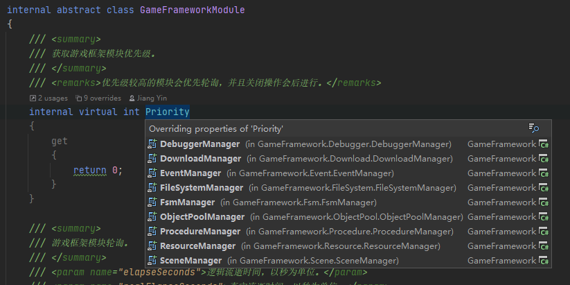
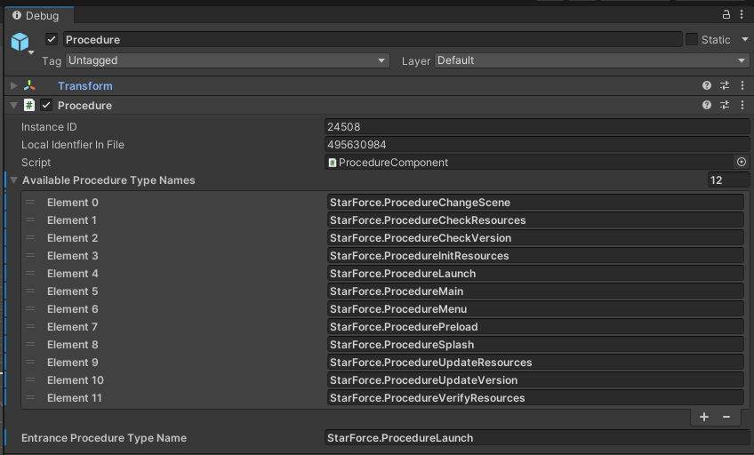
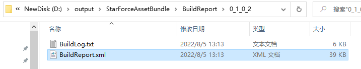
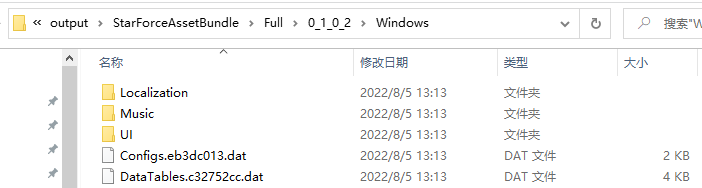
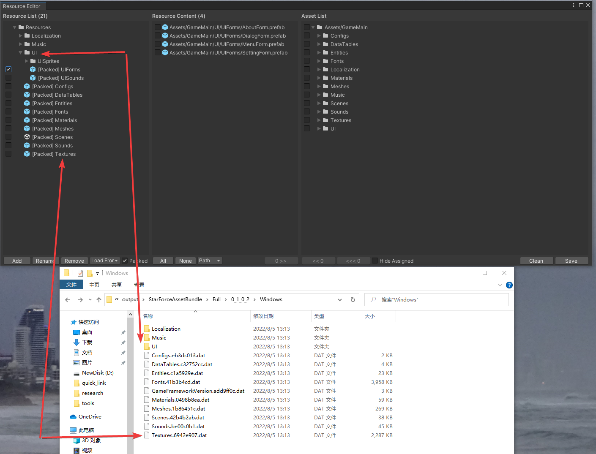
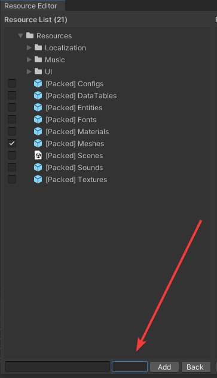
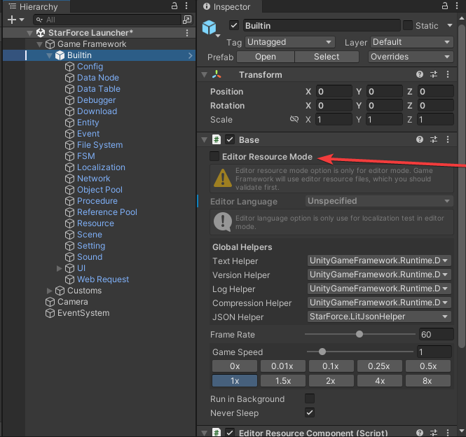
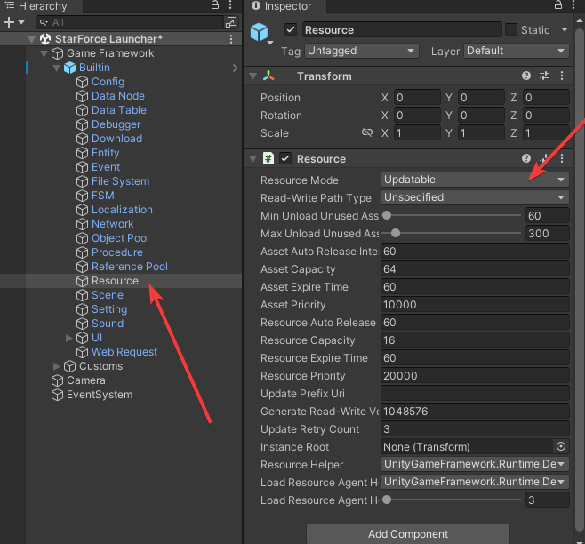

[Simeple Introduce](https://www.233tw.com/unity/49968)  
[Official](https://gameframework.cn/)  
[FAQ](https://gameframework.cn/faq/)  
[API Reference](https://gameframework.cn/api/index.html)  
[video tutorial](https://www.bilibili.com/video/BV1sE411C7cu?spm_id_from=333.337.search-card.all.click)

# Github
[GameFramework](https://github.com/EllanJiang/GameFramework)  
[UnityGameFramework](https://github.com/EllanJiang/UnityGameFramework.git)  
[StarForce(Demo Project)](https://github.com/EllanJiang/StarForce)  


# Goal
User Guide
Code anlysis(Debug)
Inspector useage
Code standard

# Code standard
* Member's name start with **m_**
* Static memeber's name start with **s_**
* To keep an empty directory on Git, put a file in it for occupation. This file should be named **.gitkeep**.
* Use string.ToLowerInvariant()

# Compile
## Build GameFramework.dll
> 1. [Download .NET Framework 3.5 SP1](https://dotnet.microsoft.com/en-us/download/visual-studio-sdks?cid=msbuild-developerpacks)
> 2. Install *dotnetfx35.exe*, Maybe should use VPN.
> 3. Build dll, and copy .dll and .xml to \StarForce\Assets\GameFramework\Libraries\
* Do not commit those dll to override existed in git.
* Publish project package must use Release version of dll.

# Common
## FsmState<T>
|Attributes                   |                                 |
|:----------------------------|:---------------------------------|
|Namespace                    |GF                              |
|Hierarchy                    ||

|Funtions                     |                                 |
|:----------------------------|:---------------------------------|
|ChangeState()                |Invoke OnLeave() and OnEnter() internally. |
* Could improve: Add changing conditions to check validity of changing rule.

## CommonFileSystemStream
|Attributes                   |                                 |
|:----------------------------|:---------------------------------|
|Namespace                    |GF                              |
|Hierarchy                    |FileSystemStream, IDisposable|

|Funtions                     |                                 |
|:----------------------------|:---------------------------------|
|Awake()                      |**[step 1]** First entry of GameFramework. Initialize Utilites, helpers and so on.  

```csharp
new CommonFileSystemStream(fullPath, access, createNew);
```

## AndroidFileSystemStream

## Variable
|Attributes                   |                                 |
|:----------------------------|:---------------------------------|
|Namespace                    |GF                              |
|Hierarchy                    ||

| Funtions   |                                           |
| :--------- | :---------------------------------------- |
| GetValue() | Return the current value.                 |
| SetValue() | set value with any of the scalar types.   |
| Clear()    | Clear the current.                        |
| ToString() | Returns a formatted string of this color. |

| Properties |                              |
| :--------- | :--------------------------- |
| Type       | The type of the scalar data. |
| Value      | The value of the scalar data |

* An Variable object can hold any of the scalar types such as int, float, and char, as well as      pointers, structures, and object id references.
* Use this class to work with such data types in collections (such as List and Dictionary), Key-value coding, and other calls that require IReference.
* Variable objects are always immutable.
```csharp
public sealed class VarInt32 : Variable<int>{...}
procedureOwner.SetData<VarInt32>("NextSceneId", GameEntry.Config.GetInt("Scene.Menu"));
```
Files:
```
\StarForce\Assets\GameFramework\Scripts\Runtime\Variable\VarInt32.cs
```

## ReferencePool
|Attributes                   |                                 |
|:----------------------------|:---------------------------------|
|Namespace                    |GF                              |
|Hierarchy                    ||

| Funtions  |                                |
| :-------- | :----------------------------- |
| Acquire() | Get an instance from the pool. |
* ReferencePool is a way to optimize game and lower the burden that is placed on the CPU when having to rapidly create and destroy new objects.

```csharp
LoadConfigFailureEventArgs loadConfigFailureEventArgs = ReferencePool.Acquire<LoadConfigFailureEventArgs>();
```

## ObjectPoolManager
| Funtions                      |                                                               |
| :---------------------------- | :------------------------------------------------------------ |
| CreateSingleSpawnObjectPool() | Get an objectPool that objects can be spawned only one time.  |
| CreateMultiSpawnObjectPool()  | Get an objectPool that objects can be spawned multiple times. |

## ObjectPool
| Funtions   |                                                   |
| :--------- | :------------------------------------------------ |
| Spawn()    | Get an object from the ObjectPool.                |
| Unspawn()  | Release an object.                                |
| CanSpawn() | Check whether the objectPool can spawn an object. |
| Register() | add a object to the the objectPool.               |

* ObjectPool is similar with ReferencePool, the differences is ObjectPool often used to manage unity object.
* whether an object can be spawned in multiple times depended on the "AllowMultiSpawn" propertie

```csharp
m_HPBarItemObjectPool = GameEntry.ObjectPool.CreateSingleSpawnObjectPool<HPBarItemObject>("HPBarItem", 16);
m_HPBarItemObjectPool.Register(HPBarItemObject.Create(hpBarItem), true);
HPBarItemObject hpBarItemObject = m_HPBarItemObjectPool.Spawn();
```

# Game Entry Flow
## BaseComponent
|Attributes                   |                                 |
|:----------------------------|:---------------------------------|
|Namespace                    |UGF                              |
|Hierarchy                    |GameFrameworkComponent : MonoBehaviour|

|Funtions                     |                                 |
|:----------------------------|:---------------------------------|
|Awake()                      |**[step 1]** First entry of GameFramework. Initialize Utilites, helpers and so on.  And RegisterComponent() |

Attached to **Builtin** node.
Component name set with :
```csharp
[AddComponentMenu("Game Framework/Base")]
```

## GameEntry (UGF)
|Attributes                   |                                 |
|:----------------------------|:---------------------------------|
|Namespace                    |Game                              |
|Hierarchy                    |MonoBehaviour|

Use GameEntry as a static class to simplify invoking and reduce cost of looping in GetComponent(). Example:
```csharp
(ProcedureBase)GameEntry.Procedure.CurrentProcedure
```
Files:
```
\StarForce\Assets\GameFramework\Scripts\Runtime\Base\GameEntry.cs
\StarForce\Assets\GameMain\Scripts\Base\GameEntry.cs
\StarForce\Assets\GameMain\Scripts\Base\GameEntry.Builtin.cs
\StarForce\Assets\GameMain\Scripts\Base\GameEntry.Custom.cs
```

## Flow chart
```mermaid
graph TB
graph TB
    1[BaseComponent.Awake] --> 1.1
    subgraph Initialize all components extend GameFrameworkComponent in Random order
    1.1[ProcedureComponent.Awake] --> 1.2[DebuggerComponent.Awake] --> 1.3[...]
    end
    1.3 --> 2.1[GameEntry.Start GameEntry.InitBuiltinComponents to bundle GameFrameworkComponents to GameEntry static members.]

     --> 3
    3[BaseComponent.Update] --> 4[GameFrameworkEntry.Update in GF] --> 5[Loop all GameFrameworkModule]
    1.3-->6
    6[ProcedureComponent.Start] --delay one frame--> 6.1[m_ProcedureManager.StartProcedure m_EntranceProcedure]
    -->7[ProcedureLaunch]--OnUpdate-->8[ProcedureSplash]
    8--EditorResourceMode-->9[ProcedurePreload]
    8--Package-->10[ProcedureInitResources]
    8--Updatable-->11[ProcedureCheckVersion]-->12{m_NeedUpdateVersion}
    12--true-->13[ProcedureUpdateVersion]
    12--false-->14[ProcedureVerifyResources]
    14-->15[ProcedureCheckResources]-->16{m_NeedUpdateResources}
    16--true-->17[ProcedureUpdateResources]
    16--false-->18[ProcedurePreload]-->19[ProcedureChangeScene]
```
GameFramework can not promise order of:
> GameFrameworkComponent in GameEntry.s_GameFrameworkComponents
GameFrameworkModule in GameFrameworkEntry.s_GameFrameworkModules

Because of :
> * All **GameFrameworkComponent** will register self in **Awake** with GameEntry.RegisterComponent(this)
> * All **GameFrameworkModule** will be created by GameFrameworkEntry.GetModule() at **first invoked**.
>   ```csharp
>   // Rule of module name.
>   string moduleName = Utility.Text.Format("{0}.{1}", interfaceType.Namespace, interfaceType.Name.Substring(1));
>   Type moduleType = Type.GetType(moduleName);
>   ```
> * The order that Unity calls each GameObject's Awake is not deterministic. [ref](https://docs.unity3d.com/ScriptReference/MonoBehaviour.Awake.html)

Attention:
>* Not recommend to set Awake order. (Edit>Project Settings>Script Execution Order)
>* Modify order of **GameFrameworkModule** by **Priority** in it.


# ...Helper
## DefaultTextHelper (UGF)
Use StringBuilder & cache it to reduce memory allocations.

# GameFrameworkComponent (UGF)
class GameFrameworkComponent : MonoBehaviour

## ConfigComponent (UGF)
|Attributes                   |                                 |
|:----------------------------|:---------------------------------|
|Namespace                    |UnityGameFramework.Runtime        |
|Hierarchy                    |GameFrameworkComponent|

Use ConfigComponent as a Component to simplify reading config information. Example:
```csharp
ConfigComponent Config = GameEntry.GetComponent<ConfigComponent>()
Config.ReadData(configAssetName, this)

ConfigComponent Config = GameEntry.GetComponent<ConfigComponent>()
int id = Config.GetInt("Scene.Menu")
```
any function that delivers its result asynchronously, make sure your file have loaded Successfully. Example:
```csharp
GameEntry.GetComponent<ConfigComponent>().Subscribe(LoadConfigSuccessEventArgs.EventId, OnLoadConfigSuccess);
GameEntry.GetComponent<ConfigComponent>().Subscribe(LoadConfigFailureEventArgs.EventId, OnLoadConfigFailure);
private void OnLoadConfigSuccess(object sender, GameEventArgs e){
    //TODO
}
private void OnLoadConfigFailure(object sender, GameEventArgs e){
    //TODO
}
```
the file can be text or byte stream

## DataTableComponent (UGF)
|Attributes                   |                                 |
|:----------------------------|:---------------------------------|
|Namespace                    |UnityGameFramework.Runtime        |
|Hierarchy                    |GameFrameworkComponent|

Use DataTableComponent as a Component to reading Excel or other files. Example:
```csharp
DataTableComponent DataTable = GameEntry.GetComponent<DataTableComponent>()
DataTable.LoadDataTable(dataTableName, dataTableAssetName, this)

DataTableComponent DataTable = GameEntry.GetComponent<DataTableComponent>()
IDataTable<DRAircraft> dtAircraft = GameEntry.DataTable.GetDataTable<DRAircraft>();
DRAircraft drAircraft = dtAircraft.GetDataRow(TypeId);
int ThrusterId = drAircraft.ThrusterId
```
any function that delivers its result asynchronously, make sure your file have loaded Successfully. Example:
```csharp
GameEntry.GetComponent<ConfigComponent>().Subscribe(LoadDataTableSuccessEventArgs.EventId, OnLoadDataTableSuccess);
GameEntry.GetComponent<ConfigComponent>().Subscribe(LoadDataTableFailureEventArgs.EventId, OnLoadDataTableFailure);
private void OnLoadDataTableSuccess(object sender, GameEventArgs e){
    //TODO
}
private void OnLoadDataTableFailure(object sender, GameEventArgs e){
    //TODO
}
```
the file can be text or byte stream

## EventComponent (UGF)
|Attributes                   |                                 |
|:----------------------------|:---------------------------------|
|Namespace                    |UnityGameFramework.Runtime        |
|Hierarchy                    |GameFrameworkComponent|

|Funtions                     |                                 |
|:----------------------------|:---------------------------------|
|Subscribe()                  |add callback to event. |
|Unsubscribe()                |cancel the callback. |
|Fire()                       |send event. |
|FireNow()                    |send event immediately. |

Files:
```
\StarForce\Assets\GameFramework\Scripts\Runtime\Event\EventComponent.cs
```
* Fire() send event at the second frame ,handle in the main thread.
* FireNow() send event immediately, it is not a thread-safe way.

## EntityComponent (UGF)
|Attributes                   |                                 |
|:----------------------------|:---------------------------------|
|Namespace                    |UnityGameFramework.Runtime        |
|Hierarchy                    |GameFrameworkComponent|

|Funtions                     |                                 |
|:----------------------------|:---------------------------------|
|ShowEntity()                 |add Entity to EntityManager and Scene.|
|HideEntity()                 |hide Entity from manager and Scene.|
|InternalHideEntity()         |hide all Entitis from manager and Scene.|
|GetEntityGroup()             |find EntityGroup from EntityManager. |
|GetEntity()                  |find Entiy from EntityManager. |

Files:
```
\StarForce\Assets\GameFramework\Scripts\Runtime\Entity\EntityComponent.cs
```

* Hide entity means putting a entity into the recycle queue.
* Entitis in the recycle queue will be released on Update() in EntityManager.

### EntityLogic

Use EntityLogic to write entity game logic.

|Attributes                   |                                 |
|:----------------------------|:---------------------------------|
|Namespace                    |UnityGameFramework.Runtime        |
|Hierarchy                    |MonoBehaviour|

|Funtions                     |                                 |
|:----------------------------|:---------------------------------|
|OnInit()                     |be called when it is being loaded.|
|OnRecycle()                  |be called when it is in Recycle Queue.|
|OnShow()                     |be called when it is added to Scene. |
|OnHide()                     |be called when it is removed from Scene. |
|OnAttached()                 |be called when a entity is attached to it. |
|OnDetached()                 |be called when a entity is detached from it. |
|OnAttachTo()                 |be called when it is attached to a entity. |
|OnDetachFrom()               |be called when it is detached from a entity. |
|OnUpdate()                   |be called every frame, if it is enabled. |

* Use Visible to Activate or deactivate the entity.
* Use CachedTransform to modify Position, rotation and scale of an entity.

Files:
```
\StarForce\Assets\GameFramework\Scripts\Runtime\Entity\EntityLogic.cs
```

## ProcedureComponent
|Attributes                   |                                 |
|:----------------------------|:---------------------------------|
|Namespace                    |UGF                              |
|Hierarchy                    |GameFrameworkComponent|

|Funtions                     |                                 |
|:----------------------------|:---------------------------------|
|Start()                |Start procedure delay one frame. |

> **ProcedureComponentInspector: GameFrameworkInspector**
> |Funtions                     |                                 |
> |:----------------------------|:---------------------------------|
> |RefreshTypeNames()          |Auto refresh procedures type after C# code compiled. |

Files:
```
\StarForce\Assets\GameFramework\Scripts\Runtime\Procedure\ProcedureComponent.cs
\StarForce\Assets\GameFramework\Scripts\Editor\Inspector\ProcedureComponentInspector.cs
```

* Config procedures by name:


* Just allow one ProcedureManager. (Because class ProcedureManager : GameFrameworkModule)
* Start entrance procedure at the second frame to promise all Awake() & Start() are executed.
```csharp
m_ProcedureManager.Initialize(GameFrameworkEntry.GetModule<IFsmManager>(), procedures);

yield return new WaitForEndOfFrame();

m_ProcedureManager.StartProcedure(m_EntranceProcedure.GetType());
```

# Resource Tools
[vedio](https://www.bilibili.com/video/BV1sE411C7cu?p=4&vd_source=e68deb734011863d4a3f9f42402d920c)
[ref 1](https://blog.csdn.net/qq_26999509/article/details/102758769)  (Some name has changed in this article, such as AssetBundleEditor.xml、AssetBundleCollection.xml、AssetBundleBuilder.xml, change from AssetBundleXXX to ResourcXXX)
[ref 2](https://gameframework.cn/uncategorized/%e4%bd%bf%e7%94%a8-assetbundle-%e6%9e%84%e5%bb%ba%e5%b7%a5%e5%85%b7/)
* AssetDatabase is verison 2 that use LMDB.

## Mode of Package  
1. Package
Build out all data files to: *Output Package Path*.
Copy *Output Package Path* to *StreamingAssets*.
This mode generate full files for Standalone Game.
2. Full Path
Build out all data and version list files to: *Output Full Path*.
Upload *Output Full Path* to http server.
This mode generate full files for Updatable Game.
3. Packed
Build out partial data to *Output Packed Path* which was set *Packed* flag in *Resource Editor*.
Copy *Output Packed Path* to *StreamingAssets*.
This mode generate files which should be published with Updatable Game.
* We always choose mode *Full Path* and *Packed* together for our game need resource update feature.


## Config Files
Could modify config file path at here.
```
\StarForce\Assets\GameMain\Scripts\Editor\GameFrameworkConfigs.cs
```
Default config path is :
```
/Assets/GameFramework/Configs/
```
## ResourceEditor
```csharp
class ResourceEditorController
class ResourceEditor : EditorWindow
```

### Step
1. Config mapping in Editor: Game Framework->Resource Tools->Resource Editor.
2. Set asset filter. ***ScanSourceAssets()*** will execute this filer.
  a. Based on guids of AssetDatabase(U3D).
  b. Skip folder(empty).
3. Organize relationship with Resource and Assets in editor.
4. Click Save button, save files:
  a. ResourceEditor.xml
  b. ResourceCollection.xml

### ResourceCollection.xml
```xml
<?xml version="1.0" encoding="UTF-8"?>
<UnityGameFramework>
  <ResourceCollection>
    <Resources>
      <Resource Name="Configs" FileSystem="GameData" LoadType="0" Packed="True" ResourceGroups="Base" />
    </Resources>
    <Assets>
      <Asset Guid="44c8db52241385c45bbb14a1718f17bf" ResourceName="Configs" />
      <Asset Guid="7fd11dc5d29076d469d414dec2818f11" ResourceName="Configs" />
      </Assets>
    </ResourceCollection>
  </UnityGameFramework>
```
```csharp
class ResourceCollection
  private readonly SortedDictionary<string, Resource> m_Resources;
  private readonly SortedDictionary<string, Asset> m_Assets;
```

## Resource Builder
```csharp
class ResourceBuilder
class ResourceBuilderController
```
### Step
1. Set output path. Must set it outside the U3D project.
2. Click build button. Wait processing.
3. Check output files:
  a. Build report:
  
  b. Output packages:
  
  c. Output & Resource Editor relation:
  
## Core Code of Resource Builder
```csharp
class ResourceBuilderController:
  public bool BuildResources()
```
### Step
1. Remove files in StreamingAssets. Will keep **.gitkeep**.
2. Remove empty directories at all.
3. Analyze asset dependency.
  a. Ignore dependency of Scene(.untiy).
  b. Ignore all Scripts.
  c. Ignore analyzied one.
4. Generate *m_DependencyResources* and *m_DependencyAssets*.
5. PrepareBuildData()
  - a. Get Resource and Assets data from: *m_Resources & m_Assets*.
  - b. Loop each asset:
    - 1. Read asset file to bytes.
    - 2. Calculate bytes CRC32.
    - 3. Get dependency data from *m_ResourceAnalyzerController*
    - 4. Add asset guid, len, hash code(CRC32), dependency asset names to *m_ResourceDatas*
  - c. Loop with *m_ResourceDatas*:
    - 1. Not allow Resource data without any asset.
    - 2. If IsLoadFromBinary, add to *binaryResourceDatas*.
    - 3. else generate AssetBundleBuild(U3D), add to *assetBundleBuildDatas* and *assetBundleResourceDatas*.
6. BuildResources() on target platforms.
  - a. Create and Clean output directories.
  - b. Clean files not relate with *assetBundleResourceDatas*. (Keep all .manifest).
  - c. Delete all .manifest without pair of data files.
  - d. At here will keep all data and manifest files at lastest building.
  - e. Call *BuildPipeline.BuildAssetBundles()*, build data and manifest to working path.
    > ```csharp
    > AssetBundleManifest assetBundleManifest = BuildPipeline.BuildAssetBundles(workingPath, assetBundleBuildDatas, buildAssetBundleOptions, GetBuildTarget(platform));
    > ```
  - f. Create *FileSystem*(GF) for saving data in this file structure in furture, and gourp by *m_ResourceDatas*.
    - i. For *m_OutputPackageFileSystems*
    - ii. For *m_OutputPackedFileSystems*  
  - g. Call *ProcessAssetBundle()* for each *ResourceData*:
    - 1. Read bytes from assetbundle file built with U3D.
    - 2. Encrypt bytes by XOR.
      > There has a question:
      > *Utility.Encryption.GetQuickXorBytes()* and *Utility.Encryption.GetXorBytes()* are not differency. Why?
    - 3. Call *ProcessOutput()* to write bytes in to *m_OutputPackageFileSystems*.( -> .dat)
      - i. For *OutputPackageSelected*
      - ii. For *OutputPackedSelected && resourceData.Packed*
      - iii. For *OutputFullSelected*. ( -> {CRC32 x8}.dat)
        > Just this mode support compress.
        > ? Should find which kind of compress.
    - 4. Generate and Add *ResourceCode* to *ResourceData* in *m_ResourceDatas*.
  - h. Call *ProcessBinary()* :
    > Like *ProcessAssetBundle()*.
    > Differency is read bytes from asset file at first step.
  - i. Call *ProcessPackageVersionList()*:
    - 1. Generate *PackageVersionList.Asset* with asset name and dependency asset index.
    - 2. Generate *PackageVersionList.Resource* from *m_ResourceDatas*.
    - 3. Generate *PackageVersionList.FileSystem* from *GetFileSystemNames(resourceDatas)*.
    - 4. Generate *PackageVersionList.ResourceGroup* from *GetResourceGroupNames(resourceDatas)*.
    - 5. Build version with callback: V0~2.
    - 6. Write to *Output Package Path* / *GameFrameworkVersion.dat*
  - j. Call *ProcessUpdatableVersionList()*:
    > Like *ProcessPackageVersionList()*.
    > Write to *Output Full Path* / *GameFrameworkVersion. {CRC32 x8}.dat*
  - k. Call *ProcessReadOnlyVersionList()*:
    - 1. Get all packaged Resource Data.
    - 2. Generate *LocalVersionList.Resource* and *LocalVersionList.FileSystem*.
    - 3. Write to *Output Packed Path* / *GameFrameworkList.dat*
  - l. Call *OnPostprocessPlatform()*. If platform is *Windows* and *outputPackageSelected* is true, copy data files to *StreamingAssets* automatically.
  - m. Call *StarForceBuildEventHandler.OnPostprocessAllPlatforms()*. We could add some operation at here.

### Principle Files  
#### XML  
* ResourceEditor.xml  
*Resource Editor* settings. Include filter of assets.
* ResourceBuilder.xml
*Resource Builder* settings.
* ResourceCollection.xml
Output of *Resource Editor* operation.

#### Output of Builder
* GameFrameworkVersion.dat / GameFrameworkVersion. {CRC32 x8}.dat
Information of resource at all. Include: Asset, Resource, FileSystem, ResourceGroup.
* GameFrameworkList.dat
Partial information of resource. Just Include: Resource, FileSystem.


### Tips  
* What is assetBundleResourceData.Variant?
It is like sub name of Resource to distinguish resource.

```csharp
validNames.Add(GetResourceFullName(assetBundleResourceData.Name, assetBundleResourceData.Variant).ToLowerInvariant());
```

* Just only allow one Asset in one Resource.
```csharp
ResourceCollection.SetResourceLoadType()
if ((loadType == LoadType.LoadFromBinary || loadType == LoadType.LoadFromBinaryAndQuickDecrypt || loadType == LoadType.LoadFromBinaryAndDecrypt) && resource.GetAssets().Length > 1)
{
    return false;
}
```

### To do
* What's the effect of m_ScatteredAssets?
I find author wrote it is not finished yet. It is designed for testing.


## Resource Flow (ProcedureCheckVersion->ProcedureVerifyResources->ProcedureCheckResources->ProcedurePreload)
### Open This Mode
1. Disable Resource Mode

2. Change Resource Mode to Updatable


### Step
1. Http Get version file from: https://starforce.gameframework.cn/Resources/{Platform}Version.txt
Example: https://starforce.gameframework.cn/Resources/WindowsVersion.txt  
Return a json file:
```json
{
  "ForceUpdateGame": false,
  "LatestGameVersion": "0.1.0",
  "InternalGameVersion": 1,
  "InternalResourceVersion": 1,
  "UpdatePrefixUri": "https://starforce.gameframework.cn/Resources/0_1_0_1/Windows",
  "VersionListLength": 7158,
  "VersionListHashCode": 1985842577,
  "VersionListCompressedLength": 2643,
  "VersionListCompressedHashCode": 288676703,
  "END_OF_JSON": ""
}
```
Set *m_CheckVersionComplete* = true

2. Compare version in *VersionListProcessor.CheckVersionList()*.
Local version file path: It is read/write path.
Example on windows10:
```
C:/Users/Administrator/AppData/LocalLow/Game Framework/Star Force/GameFrameworkVersion.dat
```
Load local *internalResourceVersion* from *GameFrameworkVersion.dat*.
Compare *internalResourceVersion*(local) with *latestInternalResourceVersion*(remote)
Set *m_NeedUpdateVersion*

3. Judge m_NeedUpdateVersion in Update().
If *m_NeedUpdateVersion* is false, Jump to 4??.
If *m_NeedUpdateVersion* is false, Jump to 4.

4. Change state to *ProcedureVerifyResources*.
5. *ResourceManager.ResourceVerifier.VerifyResources()*:
  - a. Call *m_ResourceManager.m_ResourceHelper.LoadBytes()* asynchronously.
    ```
    C:/Users/Administrator/AppData/LocalLow/Game Framework/Star Force/GameFrameworkList.dat
    ```
  - b. Callback *OnLoadReadWriteVersionListSuccess()*
6. *OnLoadReadWriteVersionListSuccess()*
  - a. Deserialize *GameFrameworkList.dat* to *LocalVersionList*
  - b. Analyze *LocalVersionList.Resource[]* and *LocalVersionList.FileSystem[]*
  - c. Combine *m_VerifyInfos*
  - d. *m_LoadReadWriteVersionListComplete* = true
7. Wait entry *ResourceManager.ResourceVerifier.Update()* in GameFramework.
  - a. Loop *m_VerifyInfos*, check each by *VerifyResource()*
    - Read from *FileSystem*
    - Compare length between file and *verifyInfo.Length*
    - Compare hashcode between file and verifyInfo.HashCode. Read from stream and step size is 4K bytes.
  - b. One loop just verify one *VersionInfo* only. And wait next Update() to check the next one.
  - c. After each loop, will refresh *EventManager* to trigger such as *ProcedureVerifyResources.OnResourceVerifySuccess()* refreshing UI.
  - d. If loop all finished, then:
    - d.1 If verify failed. Will call *GenerateReadWriteVersionList()* to fix 'GameFrameworkList.dat'
    - d.2 else verify successed. Set *ProcedureVerifyResources.m_VerifyResourcesComplete* = true
  - e. Wait Update() change state to *ProcedureCheckResources*
8. *ResourceManager.CheckResources()*
  - a. Load files asynchronously:

    | Directory                   | FileName          | LoadBytesCallbacks                      |
    |:----------------------------|:------------------|:---------------|
    |Persistence Path            |GameFrameworkVersion.dat  | OnLoadUpdatableVersionListSuccess |
    |StreamingAssets            |GameFrameworkList.dat| OnLoadReadOnlyVersionListSuccess or OnLoadReadOnlyVersionListFailure |
    |Persistence Path            |GameFrameworkList.dat| OnLoadReadWriteVersionListSuccess |
    Above functions executed in random order.
  - b. *OnLoadUpdatableVersionListSuccess()*
      - b.1. Deserialize to *UpdatableVersionList*
      - b.2. Combine *m_CheckInfos*, *m_ResourceGroups*, *m_ResourceManager.m_AssetInfos*  with *UpdatableVersionList* data.
  - c. *OnLoadReadWriteVersionListSuccess()*
  - d. *OnLoadReadOnlyVersionListFailure()*
  - e. execute *RefreshCheckInfoStatus()*.  Loop for *m_CheckInfos*
      - e.1. *RefreshStatus()*, Check resource has exist in file system in persistence path or StreamingAssets, to decide how to deal with it (Diverge to *CheckStatus* [Disuse, StorageInReadOnly, StorageInReadWrite, Update, Unavailable]).
       - e.2. Tidy (move or remove) file in *FileSystem* with results generated above.
       - e.3. Add result to *m_ResourceManager.m_ResourceInfos* and *m_ResourceManager.m_ReadWriteResourceInfos*
   - f. Remove empty FileSystem and Directory.
   - g. Set *m_CheckResourcesComplete* = true, set *m_NeedUpdateResources*
   - h. Wait Update() change state to:
        - h.1 If m_NeedUpdateResources is true, *ProcedureCheckResources*
        - h.2 else, *ProcedurePreload*
9. In *ProcedurePreload*:
  - a. LoadConfig, LoadDataTable, LoadDictionary, LoadFont and so on.
  Example:
    ```csharp
    string configAssetName = AssetUtility.GetConfigAsset(configName, false);
    m_LoadedFlag.Add(configAssetName, false);
    GameEntry.Config.ReadData(configAssetName, this);
    ```
    ```csharp
    string configAssetName = AssetUtility.GetConfigAsset(configName, false);
    m_LoadedFlag.Add(configAssetName, false);
    GameEntry.Config.ReadData(configAssetName, this);
    ```
  - b. add to *m_LoadedFlag*, and set *false*.
  - c. Check all is *true* in *m_LoadedFlag* in *Update()*
  - d. Change state to *ProcedureChangeScene*. That's all !


## Load Resource
* All resources (asset and binary) informations are managed by *ResourceManager*.
```csharp
internal sealed partial class ResourceManager : GameFrameworkModule, IResourceManager
{
  private Dictionary<string, AssetInfo> m_AssetInfos;
  private Dictionary<ResourceName, ResourceInfo> m_ResourceInfos;
}
{
  private ResourceInfo GetResourceInfo(string assetName)
  {
      if (string.IsNullOrEmpty(assetName))
      {
          return null;
      }

      AssetInfo assetInfo = m_ResourceManager.GetAssetInfo(assetName);
      if (assetInfo == null)
      {
          return null;
      }

      return m_ResourceManager.GetResourceInfo(assetInfo.ResourceName);
  }
}
```

* All assets and resources pool are managed by *ResourceManager.ResourceLoader*.
```csharp
internal sealed partial class ResourceManager : GameFrameworkModule, IResourceManager
{
  private sealed partial class ResourceLoader
  {
    private IObjectPool<AssetObject> m_AssetPool;
    private IObjectPool<ResourceObject> m_ResourcePool;
  }
}
```

### Step  
1. *ResourceManager.LoadAsset()*
```csharp
m_ResourceManager.LoadAsset(dataAssetName, priority, m_LoadAssetCallbacks, userData);
```
2. *ResourceLoader.LoadAsset()*
```csharp
m_ResourceLoader.LoadAsset(assetName, null, priority, loadAssetCallbacks, userData);
```
3. *ResourceLoader.CheckAsset()*
4. Create *LoadAssetTask* and search / create *LoadDependencyAssetTask*, add to *m_TaskPool*
```csharp
LoadAssetTask mainTask = LoadAssetTask.Create(assetName, assetType, priority, resourceInfo, dependencyAssetNames, loadAssetCallbacks, userData);
m_TaskPool.AddTask(mainTask);
```
5. If not *resourceInfo.Ready*, call m_ResourceManager.UpdateResource(). Control by *ResourceUpdater.m_UpdateCandidateInfo*
```csharp
if (!resourceInfo.Ready)
{
    m_ResourceManager.UpdateResource(resourceInfo.ResourceName);
}
```
6. Wait execute *TaskPool.Update()*:
  - 6.1 *ProcessWaitingTasks()*
    Get one free *LoadResourceAgent*
    Add to *m_WorkingAgents*
    Call *LoadResourceAgent.Start()*
    If this asset has exist in *m_ResourceLoader.m_AssetPool*, call *7.4 LoadResourceAgent.OnAssetObjectReady()*
    Call *m_Helper.ReadFile()*, load **AssetBundle** from:
    ```csharp
    m_FileAssetBundleCreateRequest = AssetBundle.LoadFromFileAsync(fullPath);
    ```
  - 6.2 *ProcessRunningTasks()*, no more important for this processing.
7. *DefaultLoadResourceAgentHelper.Update()*
```csharp
private void Update()
{
#if UNITY_5_4_OR_NEWER
    UpdateUnityWebRequest();
#else
    UpdateWWW();
#endif
    UpdateFileAssetBundleCreateRequest();
    UpdateBytesAssetBundleCreateRequest();
    UpdateAssetBundleRequest();
    UpdateAsyncOperation();
}
```
  - 7.1 *UpdateFileAssetBundleCreateRequest()*
      (*AssetBundleCreateRequest*) m_FileAssetBundleCreateRequest.**isDone**
      ```csharp
      private void OnLoadResourceAgentHelperReadFileComplete(object sender, LoadResourceAgentHelperReadFileCompleteEventArgs e)
      {
          ResourceObject resourceObject = ResourceObject.Create(m_Task.ResourceInfo.ResourceName.Name, e.Resource, m_ResourceHelper, m_ResourceLoader);
          m_ResourceLoader.m_ResourcePool.Register(resourceObject, true);
          s_LoadingResourceNames.Remove(m_Task.ResourceInfo.ResourceName.Name);
          OnResourceObjectReady(resourceObject);
      }
      ```
  - 7.2 *LoadResourceAgent.OnResourceObjectReady()*
      ```csharp
      private void OnResourceObjectReady(ResourceObject resourceObject)
      {
          m_Task.LoadMain(this, resourceObject);
      }
      public void LoadMain(LoadResourceAgent agent, ResourceObject resourceObject)
      {
          m_ResourceObject = resourceObject;
          agent.Helper.LoadAsset(resourceObject.Target, AssetName, AssetType, IsScene);
      }

      class DefaultLoadResourceAgentHelper
      {
        public override void LoadAsset(object resource, string assetName, Type assetType, bool isScene)
        {
          AssetBundle assetBundle = resource as AssetBundle;
          m_AssetBundleRequest = assetBundle.LoadAssetAsync(assetName);
        }
      }
      ```
  - 7.3 *UpdateAssetBundleRequest()*
    (*AssetBundleCreateRequest*) m_AssetBundleRequest.**isDone**
    ```csharp
    private void OnLoadResourceAgentHelperLoadComplete(object sender, LoadResourceAgentHelperLoadCompleteEventArgs e)
    {
      OnAssetObjectReady()
    }
    ```
  - 7.4 *OnAssetObjectReady()*
    Callback which set at **Step 1**
    ```csharp
    public override void OnLoadAssetSuccess(LoadResourceAgent agent, object asset, float duration)
    {
        base.OnLoadAssetSuccess(agent, asset, duration);
        if (m_LoadAssetCallbacks.LoadAssetSuccessCallback != null)
        {
            m_LoadAssetCallbacks.LoadAssetSuccessCallback(AssetName, asset, duration, UserData);
        }
    }
    ```
8. Load Scene Step
  It like paragraph 7. But judged if scene, will use special API for it in Unity3D.
  ```csharp
  m_AsyncOperation = SceneManager.LoadSceneAsync(sceneName, LoadSceneMode.Additive);
  ```
  ```csharp
  UpdateAsyncOperation()

  if (m_Task.IsScene)
  {
    m_ResourceLoader.m_SceneToAssetMap.Add(m_Task.AssetName, asset);
  }

  class ResourceManager.ResourceLoader
  {
    private void OnLoadResourceAgentHelperLoadComplete(object sender, LoadResourceAgentHelperLoadCompleteEventArgs e)
    {
      if (m_Task.IsScene)
      {
          assetObject = m_ResourceLoader.m_AssetPool.Spawn(m_Task.AssetName);
      }
      OnAssetObjectReady(assetObject);
    }
  }

  private void OnAssetObjectReady(AssetObject assetObject)
  {
      m_Helper.Reset();

      object asset = assetObject.Target;
      if (m_Task.IsScene)
      {
          m_ResourceLoader.m_SceneToAssetMap.Add(m_Task.AssetName, asset);
      }

      m_Task.OnLoadAssetSuccess(this, asset, (float)(DateTime.UtcNow - m_Task.StartTime).TotalSeconds);
      m_Task.Done = true;
  }
  ```

## Load Scene
### Step
```csharp
GameEntry.Scene.LoadScene(AssetUtility.GetSceneAsset(drScene.AssetName), Constant.AssetPriority.SceneAsset, this)
{
  m_SceneManager.LoadScene(sceneAssetName, priority, userData)
  {
    m_ResourceManager.LoadScene(sceneAssetName, priority, m_LoadSceneCallbacks, userData);
    {
      m_ResourceLoader.LoadScene(sceneAssetName, priority, loadSceneCallbacks, userData);
      {
        LoadSceneTask mainTask = LoadSceneTask.Create(sceneAssetName, priority, resourceInfo, dependencyAssetNames, loadSceneCallbacks, userData);
        m_TaskPool.AddTask(mainTask);
        # Change to paragraph 6.
      }
    }
  }
}
```

## Unload Scene  
### Step
```csharp
GameEntry.Scene.UnloadScene()
{
  SceneManager.UnloadScene()
  {
    ResourceManager.UnloadScene()
    {
      ResourceLoader.UnloadScene()
      {
        m_SceneToAssetMap.Remove(sceneAssetName);
        m_AssetPool.Unspawn(asset);
        m_AssetPool.ReleaseObject(asset);
        ResourceManager.m_ResourceHelper.UnloadScene(sceneAssetName, unloadSceneCallbacks, userData)
        {
          AsyncOperation asyncOperation = SceneManager.UnloadSceneAsync(SceneComponent.GetSceneName(sceneAssetName));
        }
      }
    }
  }
}
```

## Unload Resource
### Step
1. Unspawn from ObjectPool
```csharp
ResourceComponent.UnloadAsset()
{
  ResourceManager.UnloadAsset()
  {
    ResourceLoader.UnloadAsset()
    {
      m_AssetPool.Unspawn(asset)
      {
        internalObject.Unspawn();
        if (Count > m_Capacity && internalObject.SpawnCount <= 0)
        {
            Release();
        }
      }
    }
  }
}
```
2. Release from ObjectPool in Update()
```csharp
ObjectPoolManager.Update()
{
  ObjectPoolManager.ObjectPool.Release()
  {
    # Find each could released
    ReleaseObject()
    {
      internalObject.Release(false)
      {
        m_EntityHelper.ReleaseEntity(m_EntityAsset, Target)
        {
          m_ResourceComponent.UnloadAsset(entityAsset);
          Destroy((Object)entityInstance);
        }
      }
      ReferencePool.Release(internalObject);
    }
  }
}
```
