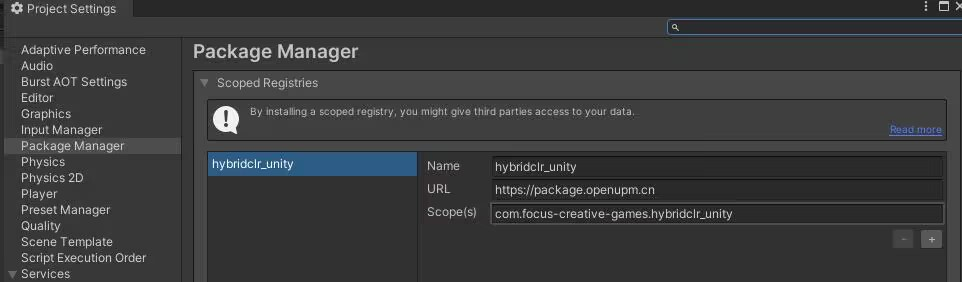
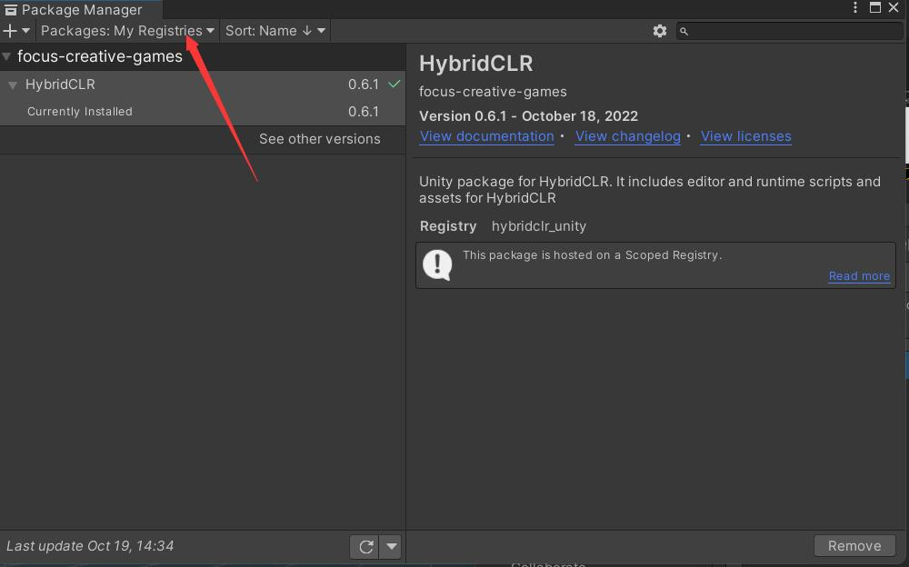
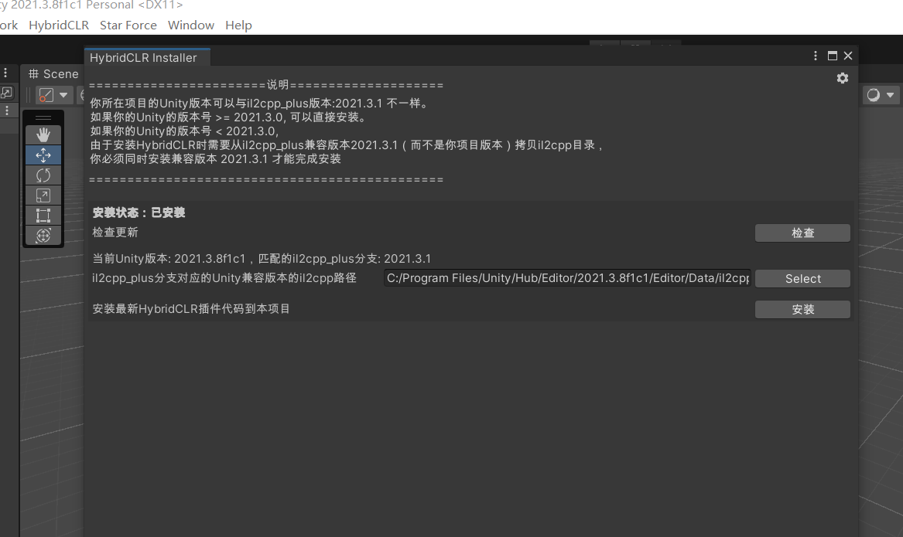
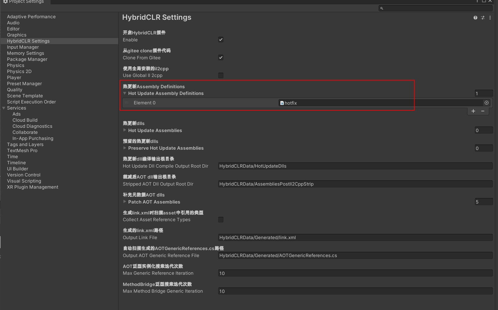
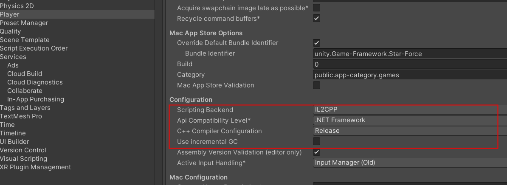

# HybridCLR

[Official Documentation](https://focus-creative-games.github.io/hybridclr/about/)  
[video tutorial](https://www.bilibili.com/video/BV1aP4y1o7xi/?spm_id_from=333.337.search-card.all.click)  

Advantage
-HybridCLR expands the code of il2cpp, making it change from a pure AOT runtime to a 'AOT+Interpreter' hybrid runtime, which supports dynamic loading of assemblies natively , so that games packaged based on il2cpp backend can be efficiently executed in AOT+interpreter mixed mode not only on Android platform, but also on IOS, Consoles and other platforms that restrict JIT. Hot updates are fully supported from the bottom up.
 
Features
- Features complete. Nearly complete implementation of the [ECMA-335 specification](https://www.ecma-international.org/publications-and-standards/standards/ecma-335/), except for the features below "Limitations and Notes" are supported.
- Zero learning and usage costs. HybridCLR enhances the pure AOT runtime into a full runtime, making hot update code work seamlessly with AOT code. Script classes and AOT classes can write code such as inheritance, reflection, multi-threading (volatile, ThreadStatic, Task, async) at will in the same runtime. There is no need to write any special code, no code generation, and no special restrictions.
- Execute efficiently. Implemented an extremely efficient register interpreter that outperformed other hot update schemes by a large margin by all metrics. [Performance test report](https://focus-creative-games.github.io/hybridclr/benchmark/#performance test report)
- Memory efficient. The classes defined in the hot update script occupy the same memory space as ordinary C# classes, which is far superior to other hot update solutions. [Memory usage report](https://focus-creative-games.github.io/hybridclr/benchmark/#Memory usage report)
- Native support for hotfix to repair part of AOT code. Adds almost no development and runtime overhead.

## Install
- Set Scoped Registeries。
 name hybridclr_unity
 URL https://package.openupm.cn
 Scope(s) com.focus-creative-games.hybridclr_unity


- In Package Manager window，change to My Registries and install hybridclr_unity package
- 

- Open unity project, and click menu "HybridCLR/Installer...", then Click install button to install component.


- Click menu "HybridCLR/Generate/All" to genrate hybridclr code.

- Create assembly definition in assets and put  hot update script files in it

- Click menu "HybridCLR/Setting", set hot update assembly definition.


- Click menu "build setting/Build and Run", make sure build project once before compile hot update files for Stripping code

- Click menu "HybridCLR/CompileDll", compile hot update files by platform. dll will be genrated in "HybridCLRData\HotUpdateDlls\{platform}\"
 

- Edit project setting , Configuration/Scripting Backend to IL2CPP, Configuration/Api Compatibility Level to .NET Framework,  unselect Use Incremental GC SelectBox
 

## Code
AOT Generics may cause problem, HybridCLR solve it by use HybridCLR.RuntimeApi.LoadMetadataForAOTAssembly, make sure call the function before Load hot update script
```csharp
        public static readonly string[] AOTDllNames =
        {
            "mscorlib.dll",
            "System.dll",
            "System.Core.dll",
            "UnityGameFramework.Runtime.dll"
        };
        
        private static unsafe void OnLoadAOTDllSuccess(string assetName, object asset, float duration, object userdata)
        {
            TextAsset dll = (TextAsset) asset;
            byte[] dllBytes = dll.bytes;
            fixed (byte* ptr = dllBytes)
            {
                // 加载assembly对应的dll，会自动为它hook。一旦aot泛型函数的native函数不存在，用解释器版本代码
                int err = **HybridCLR.RuntimeApi.LoadMetadataForAOTAssembly**((IntPtr) ptr, dllBytes.Length);
            }
            AOTLoadFlag++;
            Log.Debug("AOTLoadFlag :" +AOTLoadFlag);
            if (AOTLoadFlag == AOTFlag)
            {
                StartHotfix();
            }
        }
```

## Performance
* To avoid intensive calculations on Interpreter on HybridCLR. Should put them on AOT also.