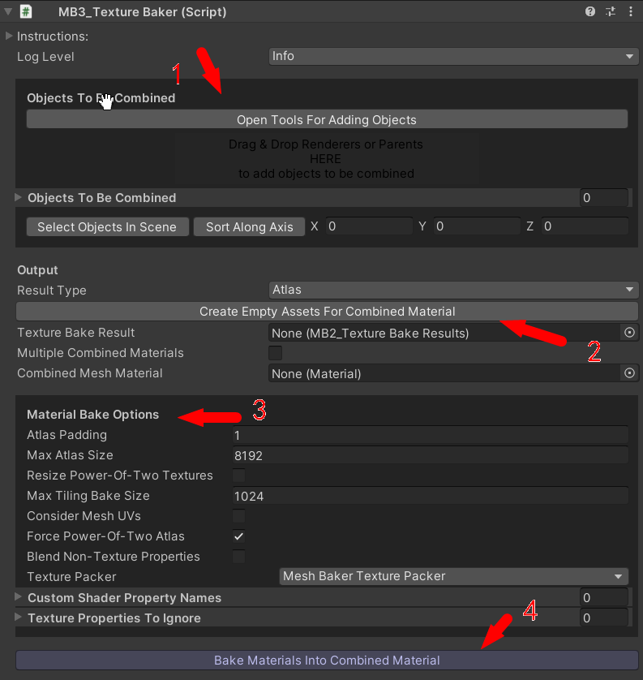
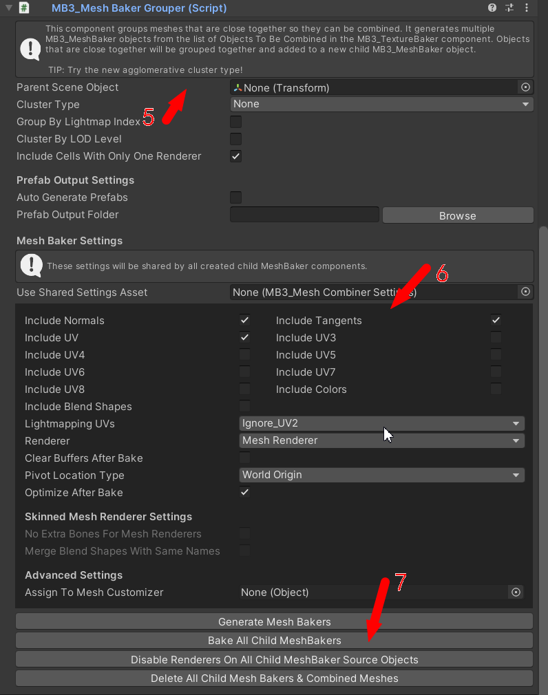
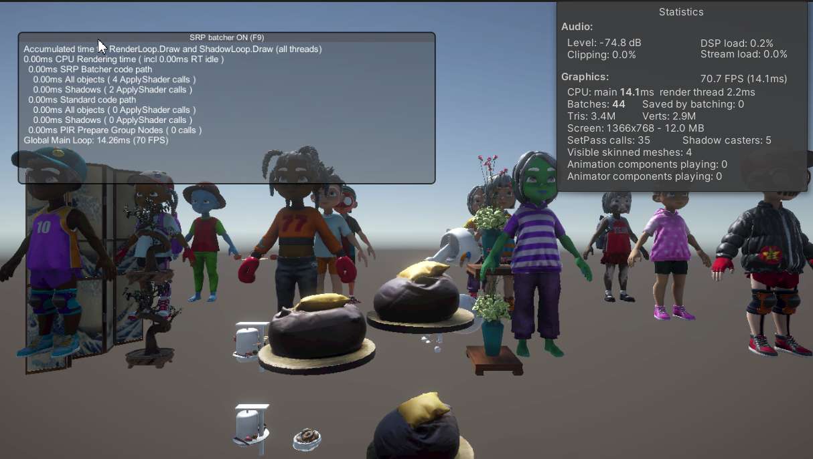
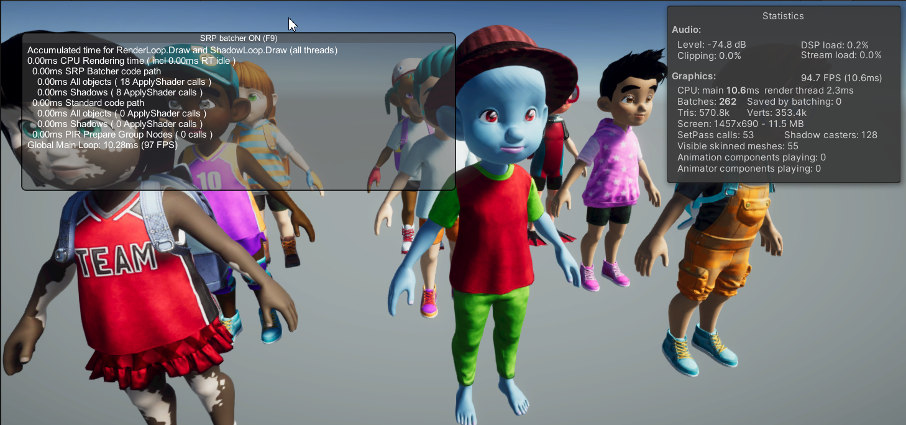

# MeshBaker

Quick-start (Combining Meshes and Materials)

This is not the only way to use Mesh Baker but it is a common use case.

- Create a new Mesh Baker object in your scene. If your source objects exceed 64k vertices use a Tex-tureBaker & MultiMeshBaker
GameObject -> Create Other -> Mesh Baker -> TextureBaker & MeshBaker
- Add objects to combine. For best results, these should use the same shader(s), but they don’t have to.Use the provided tools to make this fast and easy.
- Click ‘Create Empty Assets For Combined Material’. This will create material assets for the combinedmaterial(s) and also an MB2_TextureBakeResults asset that contains information mapping materialsto UV rectangles in the atlases.
- Select shader on Combined Mesh Material. Mesh Baker tries to duplicate the material settings on thefi rst object in the list of objects to combine. Mesh Baker will build a texture atlas for each textureproperty in this shader (main, bump, specular etc…).
- Set any options then click ‘Bake Materials into a Combined Material’.
- Look at warnings / errors in the console. Decide if action needs to be taken. Look at the combined ma-terial asset in the inspector to see that the generated atlases look correct. You may need to adjustnon-texture properties in the combined material shader(s) to match the source material(s).
- If your meshes are distributed throughout the scene or clustered you may want to use theMB3_ClusterGrouper to group your meshes into multiple combined meshes. This will create severalMB3_MeshBaker components.
- In the MB3_MeshBaker component click ‘Bake’. This will create the combined mesh and a new gameobject that uses it. The combined mesh is an instance (not an asset) so it can’t be used in a prefab. Ifyou want to use the combined mesh in a prefab then select “output” -> “bake into prefab” (Create aprefab with an empty GameObject and drag it to the resultPrefab slot). The mesh will be saved as anasset and assigned to the provided prefab.

# How It Works

Mesh Baker consists of two core components. A MB3_TextureBaker component and a MB3_MeshBaker component. These components can be used together or separately. 

- The MB3_TextureBaker creates atlas assets and a special Texture Bake Result asset that maps thesource materials to UV rectangles in the atlases. Once this has been created thenany mesh that usesthe source materials can be added to the combined mesh, even meshes that were not included in theoriginal texture bake. The user must provide:
    - A Combined Mesh Material and set the shader on this material
    - A Texture Bake Result (MB2_TextureBakeResults)
    - A list of game objects with MeshRenderers or SkinnedMeshRenderers to be combined

- MB3_TextureBaker has a list of names of common texture properties that it looks for in the CombinedMesh Material shader. An atlas will be created for each texture property found in this shader. If the shader contains texture properties with non-standard names these should be added to the list of “Custom Shader Property Names”. For each object to be combined, the materials on that object are collectedand the textures in those materials are added to the appropriate atlases. If a material does not have arequired texture property or a texture is not assigned for a property then Mesh Baker makes a calcu-lated guess at the correct color for the atlas based on the name of the texture property and other prop-erties that may be present. 

- The generated atlases are added to the Texture Bake Result (MB2_TextureBakeResults) asset. This asset also contains information mapping source materials to their texture locations (UV rectangles) in the atlases. it can be used in other scenes or even exported with the combined materialand atlases and used in another project.

- A list of objects to be combined (game objects or prefabs with MeshRenderers or SkinnedMeshRen-derer components). This is usually the same as the list of objects used to build the atlases, however, it can include objects not on that list as long as all materials on included objects have been baked intothe Texture Bake Result. As each mesh in the list of objects to be combined is added, mesh baker uses its materials to look up thecorrect UV rectangle in the MB2_TextureBakeResults object. The UVs in the mesh to be added arescaled to fit this UV rectangle. If “fix out of bounds UVs” was checked in the MB3_TextureBaker component, then UVs are scaled to be in the range 0,0 .. 1,1. All submeshes on the source objects are collapsedinto a single mesh unless the user is using the multiple combined materials option in which case MeshBaker creates submeshes.

# performance

## Browser Version

* Android 
    * Chrome, Beta 108.0.5359.128
* iOS
    * Chrome, 108.0.5359.52
    * Safari, (iOS 15.6.1)

## Screen Size:
* Android: 3200x1440
* iOS: 2424x1074

## Device
* Android: Xiaomi 11
* iOS: XR

### Demo1

- FPS

| WebGL | Platform | before Combined | after Combined |
| :---- | :------: | :-------------: | :------------: |
| 1.0   |   iOS    |        6        |       11       |
| 1.0   | Android  |       28        |       34       |
| 2.0   |   iOS    |        1        |       2        |
| 2.0   | Android  |        8        |       9        |

- Batches (all objects + shadows)

| WebGL | Platform | Before Combined | after Combined |
| :---- | :------: | :-------------: | :------------: |
| 1.0   |   iOS    |     262+10      |      4+2       |
| 1.0   | Android  |     262+10      |      4+2       |
| 2.0   |   iOS    |      39+9       |      4+2       |
| 2.0   | Android  |      39+9       |      4+2       |

- note: 
    - Demo on iPhone crashed occasionally, it is not stable enought.
    - For each object to be combined, the materials on that object are collectedand the textures in those materials are added to the appropriate atlases, but some textures may not use frequently before combined(For example Emission Map and Detail Base Map..), that may cause low FPS after combined.
    
### Demo2 (No Emission Map and Detail Base Map)

- FPS

| WebGL | Platform | before Combined | after Combined |
| :---- | :------: | :-------------: | :------------: |
| 1.0   |   iOS    |       32        |       60       |
| 1.0   | Android  |       40        |       60       |
| 2.0   |   iOS    |        6        |       7        |
| 2.0   | Android  |       52        |       60       |

- Batches (all objects + shadows)

| WebGL | Platform | Before Combined | after Combined |
| :---- | :------: | :-------------: | :------------: |
| 1.0   |   iOS    |      81+4       |      1+1       |
| 1.0   | Android  |      81+4       |      1+1       |
| 2.0   |   iOS    |      18+4       |      1+1       |
| 2.0   | Android  |      18+4       |      1+1       |

## Conclusion
- Demos  after combined perform much better on WebGL1.0
- Things seems to be complex on WebGL2.0, Combine can reduce Batches, but Shader may become more complex then  before. FPS performance will depends on the Textures, Materials and Shaders before Combine.