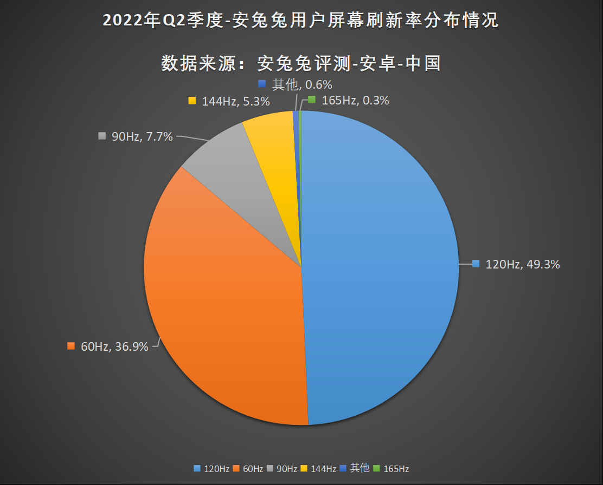

# Mobile Device Compatibility

## Android
### Screen Size
*  Diagonal Size >= 6.0 inches

### Screen Resolution
* Height >=1080p
* Width >= 1920

### Frame Rate
* Max Rate <= 60 fps

### RAM 
* Max Memory Usage <= 2GB

### ROM
* Max Package Size <= ?

### System Version
* Version >= 5.0, OpenGL ES >= 3.0 (Not support 2.0)

## iOS
iPhone 6s的屏幕为4.7英寸视网膜高清显示屏，屏幕分辨率为1334 x 750 像素分(16:9)，对比度为1400:1，500 尼特最大亮度，像素密度为326 ppi
iPhone 6s的运行内存为2GB；

## Reference
[Antutu User Preference 2022Q2](https://www.antutu.com/doc/127663.htm)
[iOS Devices](https://www.bilibili.com/read/cv16039737)
[iOS and iPadOS usage](https://developer.apple.com/support/app-store/)
