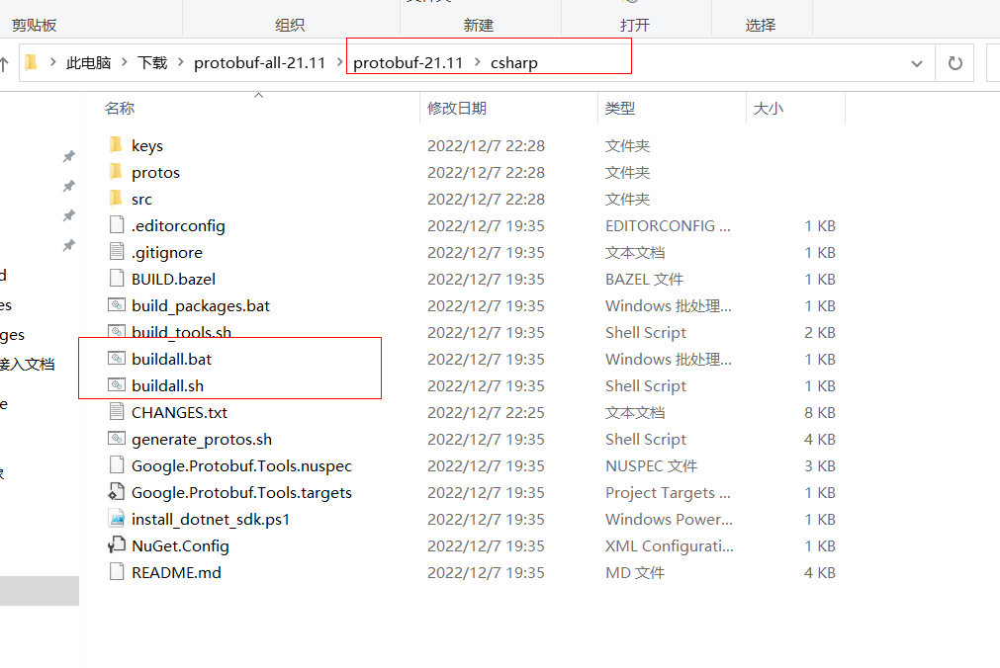
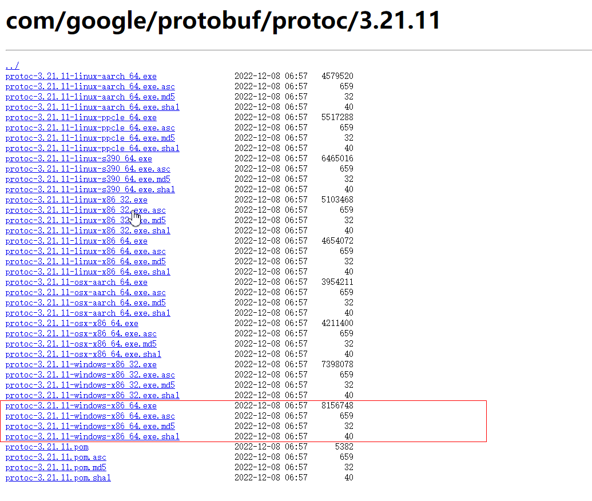
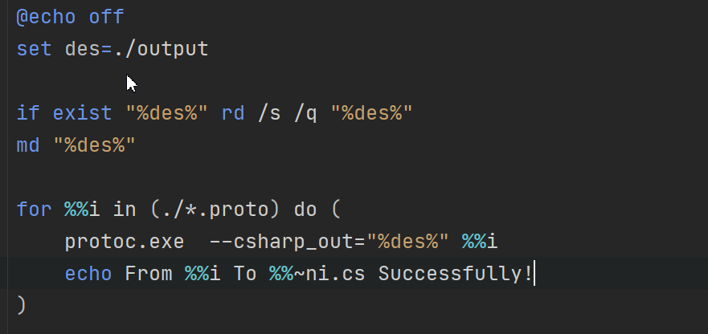

# Protobuf

[Official Documentation](https://developers.google.com/protocol-buffers)  

Advantage
- Protocol buffers are Google's language-neutral, platform-neutral, extensible mechanism for serializing structured data – think XML, but smaller, faster, and simpler. You define how you want your data to be structured once, then you can use special generated source code to easily write and read your structured data to and from a variety of data streams and using a variety of languages.
 

## Install
- Download and install the protocol buffer compiler
 URL https://github.com/protocolbuffers/protobuf/releases
 download protobuf-all-21.11.zip
 compile csharp project

- put Protocol Buffers runtime library into Libraries folder
 
- Download  Google.Protobuf.Tools
   URL https://repo1.maven.org/maven2/com/google/protobuf/protoc/3.21.11/
   download protoc-3.21.11-windows-x86_64.exe
   both proto2 and proto3 syntax will be supported by protoc-3.0 or later
   
 
- compiler .proto files and generate csharp file
    
   
## Code

- proto to stream
((Google.Protobuf.IMessage) message).WriteTo(stream);

- stream to proto
((Google.Protobuf.IMessage)message).MergeFrom(stream.GetBuffer(), (int)stream.Position, (int)stream.Length);

- proto to byte[]
((Google.Protobuf.IMessage) message).ToByteArray();

- byte[] to proto
((Google.Protobuf.IMessage)message).MergeFrom(bytes, index, count);

## Using in GameFramework

- implement PacketHandlerBase abstract class
        
        public abstract class ET_PacketHandler : PacketHandlerBase {

            public sealed override void Handle(object sender, Packet packet) {
                if (packet.GetType().BaseType == typeof(SCPacketBase)) {
                    SCPacketBase msg = packet as SCPacketBase;
                    GameEntry.Net.ProcessMsg(msg);
                }
            }
        }

- implement  CSPacketBase and SCPacketBase abstract class

        namespace protobufPackage
        {
            public partial class protobufMessage : CSPacketBase
            {
                public override int Id
                {
                    get { return protobufMessageId; }
                }

                public override void Clear()
                {

                }
            }
            
            public partial class protobufMessage : SCPacketBase
            {
                public override int Id
                {
                    get { return protobufMessageId; }
                }

                public override void Clear()
                {

                }
            }
        ｝
        
    protobufPackage and protobufMessage would be defined in .proto files.

- implement INetworkChannelHelper(implement Serialize, DeserializePacketHeader, DeserializePacket abstract class)

            public bool Serialize<T>(T packet,Stream destination) where T : Packet
            {
                PacketBase packetImpl = packet as PacketBase;
                if (packetImpl == null)
                {
                    Log.Warning("Packet is invalid.");
                    return false;
                }

                if (packetImpl.PacketType != PacketType.ClientToServer)
                {
                    Log.Warning("Send packet invalid.");
                    return false;
                }

                memoryStream.Seek(PacketHeaderLength, SeekOrigin.Begin);
                memoryStream.SetLength(PacketHeaderLength);
                ProtobufHelper.ToStream(packetImpl, memoryStream);

                // 头部消息
                ET_CSPacketHeader packetHeader = ReferencePool.Acquire<ET_CSPacketHeader>();
                packetHeader.PacketLength = (int)memoryStream.Length;
                packetHeader.MessageCmd = packetImpl.HeadId;      
                packetHeader.MessageUId = ETMsg.m_Uid;

                memoryStream.Position = 0;
                this.outBytes[0].WriteTo(0,packetHeader.PacketLength);
                this.outBytes[1].WriteTo(0,packetHeader.MessageCmd);
                this.outBytes[2].WriteTo(0, packetHeader.MessageUId);
                int index = 0;
                foreach(var bytes in this.outBytes)
                {
                    Array.Copy(bytes, 0, memoryStream.GetBuffer(), index, bytes.Length);
                    Array.Reverse(bytes);
                    index += bytes.Length;
                }

                ReferencePool.Release(packetHeader);

                memoryStream.WriteTo(destination);

                long len = destination.Length;
                long pos = destination.Position;
                byte[] temp = (destination as MemoryStream).GetBuffer();
                return true;
            }

            public IPacketHeader DeserializePacketHeader(Stream source, out object customErrorData)
            {
                customErrorData = null;

                ET_SCPacketHeader scHeader = ReferencePool.Acquire<ET_SCPacketHeader>();
                MemoryStream memoryStream = source as MemoryStream;
                if(memoryStream != null)
                {
                    int index = 0;
                    foreach(var bytes in this.inBytes)
                    {
                        Array.Copy(memoryStream.GetBuffer(), index, bytes, 0, bytes.Length);
                        Array.Reverse(bytes);
                        index += bytes.Length;
                    }
                    int packetSize = BitConverter.ToInt32(inBytes[0]);
                    int MessageCmd = BitConverter.ToInt32(inBytes[1]);
                    long MessageUId = BitConverter.ToInt64(inBytes[2]);
                    scHeader.PacketLength = packetSize - ETPackets.ET_PacketHeadLength;
                    scHeader.MessageCmd = MessageCmd;
                    scHeader.MessageUId = MessageUId;
                    return scHeader;
                }

                return null;
            }
        
            public Packet DeserializePacket(IPacketHeader packetHeader, Stream source, out object customErrorData)
            {
                customErrorData = null;
                ET_SCPacketHeader header = packetHeader as ET_SCPacketHeader;
                if(header == null)
                {
                    Log.Warning("Packet header is invalid.");
                    return null;
                }

                PacketBase packetBase = null;
                if (header.IsValid)
                {
                    int id = 0;
                    ETMsg.CMDDictionary.TryGetValue(header.MessageCmd, out id);
                    Type packetType = GetServerToClientPacketType(id);
                    if(packetType != null && source is MemoryStream)
                    {
                        object instance = Activator.CreateInstance(packetType);
                        packetBase = (PacketBase)ProtobufHelper.FromStream(instance, (MemoryStream)source);
                        packetBase.HeadId = header.MessageCmd;
                    }
                    else
                    {
                        Log.Warning("Can not deserialize packet for packet id '{0}'.", header.Id.ToString());
                    }
                }
                else
                {
                    Log.Warning("Packet header is invalid.");
                }
                ReferencePool.Release(header);
                return packetBase;
            }

    Note : C# itself doesn't define the endianness. however, The BitConverter class has an IsLittleEndian field to tell you how it will behave, but it doesn't give the choice. The same goes for BinaryReader/BinaryWriter. using Array.Reverse() reverse buffers which is big endian.
            
