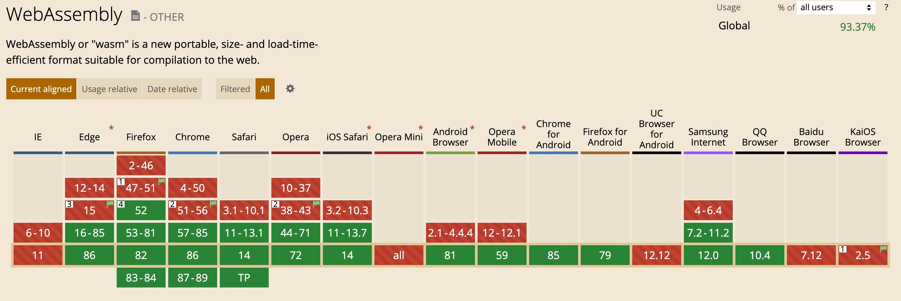
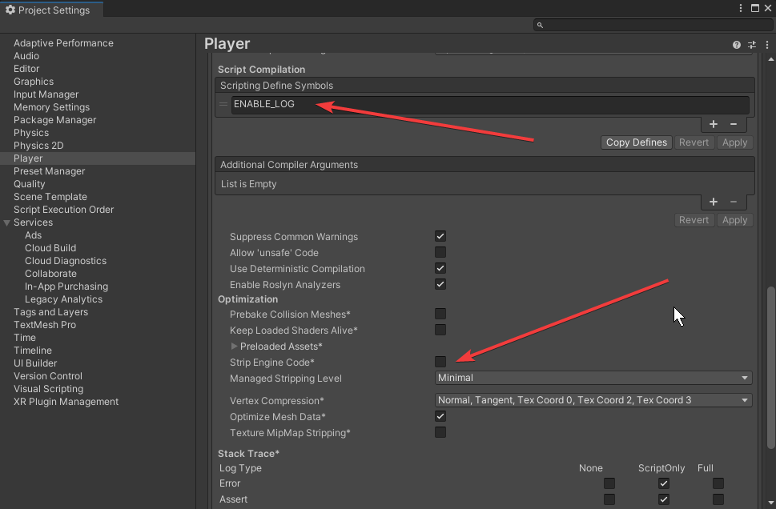
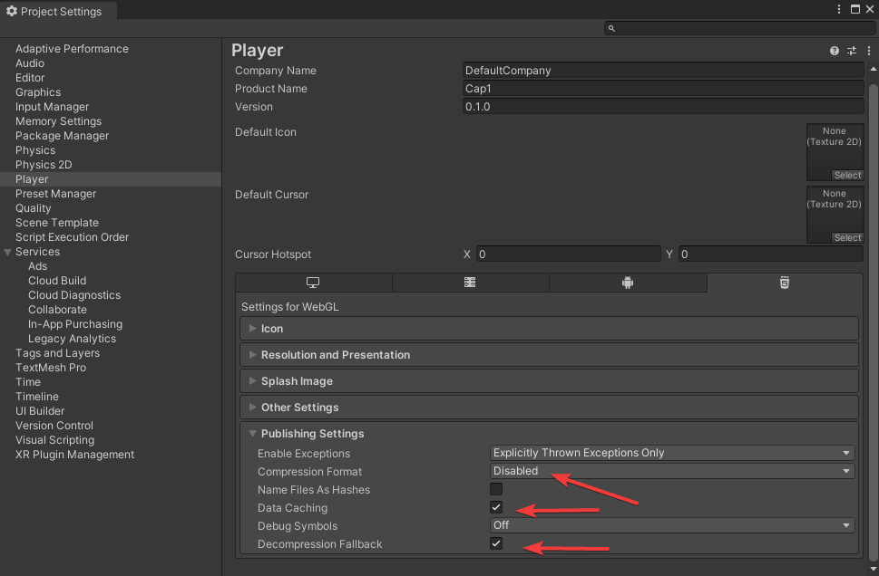
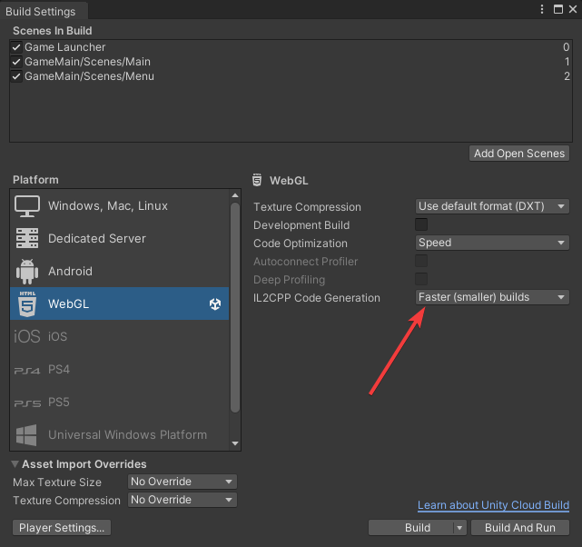

# Reference
[How to use IndexedDB](https://hacks.mozilla.org/2012/02/storing-images-and-files-in-indexeddb/)
[IndexedDB API](https://developer.mozilla.org/en-US/docs/Web/API/IndexedDB_API/Using_IndexedDB)
[W3C](https://www.w3.org/TR/IndexedDB/)
[Want to load from db in js synchronize??](javascript promise)
[Interact between U3D and JS](https://docs.unity3d.com/Manual/webgl-interactingwithbrowserscripting.html)
[Interact between U3D and JS 2](https://docs.unity3d.com/2022.2/Documentation/Manual/webgl-interactingwithbrowserscripting.html)
[WebGL memory & Asset Data in U3D](https://docs.unity3d.com/2020.1/Documentation/Manual/webgl-memory.html)
[Customize the WebGL Cache behavior](https://docs.unity3d.com/2022.2/Documentation/Manual/webgl-caching.html)
[Deploy template of Http Server](https://docs.unity3d.com/2022.2/Documentation/Manual/webgl-server-configuration-code-samples.html)
[Unity-StripCode](https://www.cnblogs.com/littleperilla/p/15997214.html)

## Fully shared generic
[What is?](https://blog.unity.com/technology/feature-preview-il2cpp-full-generic-sharing-in-unity-20221-beta)
```
Wouldn’t it be great to have just one, fully shared generic implementation for any List<T>? Well, check out the IL2CPP Code Generation option “Faster (smaller) builds” in Player Settings. 
```

## WebAssembly
[About WebAssembly](https://www.zhihu.com/question/304577684)
[WebAssembly vs Javascript](https://zhuanlan.zhihu.com/p/57001874)
[Official website](https://webassembly.org/)
> * Not support multi-threads in WebAssembly
> * Compatibility


## Unity WebGL Templates 
```
C:\Program Files\Unity\Hub\Editor\2021.3.8f1c1\Editor\Data\PlaybackEngines\WebGLSupport\BuildTools\WebGLTemplates
```
# Resolution Test
# Use browser file-cache
* Step:
    1. Browser will cache files after requesting.
    2. Will get file from local cache will request same file again, 
    3. We implement this feature by *UnityWebRequest* in Unity.
* Result:
    1. *UnityWebRequest* could load file from cache by URL.
    2. *UnityWebRequest* just only support asynchronizing mode.
* Problem:
    1. Because of difference operations between asynchronizing of *UnityWebRequest* and synchronizing of *FileSystem* in *GameFramework*.
    2. Because of coroutine of Unity and C# must return **IEnumerator** until to root of *MonoBehavior* class to keep current logic holding with **yield return StartCoroutine()**
    3. So we must re-structure*GameFramework* *FileSystem*  if want to implement this feature. But workload is too high.


# Use browser IndexedDB
* Step:
    1. *FileStream* of C# could visit data in IndexedDB after compiled to java script. 
    2. Modify *DefaultResourceHelper* class loading function on Web GL. Use *FileStream* in asynchronizing mode instead of *UnityWebRequest* in synchronizing mode. But also use *callback* to simulate synchronizing.
    3. Set *Resource Mode* of GameFramework on *Updatable*.
    ~~4. Copy resource packages into HTTP server.~~
        ```
        D:\output\Cap1AssetBundle\Full\0_1_0_2\WebGL
        ```
     5. Settings:
     
     
    
* Result:
    This solution is OK.
    1. IndexedDB snapshot:
        

* GameFramework fork:
https://github.com/valyli/GameFramework

* Next to do:
    1. How to upgrade client resource?
    2. How to upgrade client code? (or use HybridCLR useGlobalIl2cpp=true)
    3. How to resolve strip code problem?
    4. Enhance download speed.
    5. Open gzip for resources. [ref](https://zhuanlan.zhihu.com/p/475307249)
    6. Check is there have IndexedDB flush problem?[ref](https://gamedev.stackexchange.com/questions/184369/file-saved-to-indexeddb-lost-unless-we-change-scenes)
    7. Catch url parameters.[ref](https://blog.csdn.net/xunideshijie/article/details/123795652)
    8.  Interact between Unity and Java script. [ref](https://docs.unity3d.com/Manual/webgl-interactingwithbrowserscripting.html) [ref2](https://www.cnblogs.com/littleperilla/p/15640464.html)
    9. Review on official troubleshooting. [ref](https://docs.unity3d.com/2019.2/Documentation/Manual/webgl-debugging.html)
    10. How to debug webgl via unity tools on pc and mobile?
    11. Support https protocal.
    12. Verify webgl on iOS. [OK, on iOS 15.6]
    13. Resolve striping of code. [OK, by Fully shared generic]
    14. Should we catch exception at outside of WebAssembly and How?
    15. Resovle warning: 
        ```
        warning: 2 FS.syncfs operations in flight at once, probably just doing extra work
        ```
    16. Rendering Limitation on WebGL. [ref](https://www.cnblogs.com/littleperilla/p/15673963.html)
    17. Remove white loading bar. [ref](https://www.cnblogs.com/littleperilla/p/15673963.html)


# Other Problems:
1. Should disable ***Strip Engine Code*** in Untiy setting.
    ```
    This could be caused by a class being stripped from the build even though it is needed. Try disabling 'Strip Engine Code' in Player Settings.
    ```
2. ExecutionEngineException: Attempting to call method 'Test::OnMessage<Test+AnyEnum>' for which no ahead of time (AOT) code was generated.  Consider increasing the --generic-virtual-method-iterations=1 argument
[feature-preview-il2cpp-full-generic-sharing-in-unity-20221-beta](https://blog.unity.com/technology/feature-preview-il2cpp-full-generic-sharing-in-unity-20221-beta)
