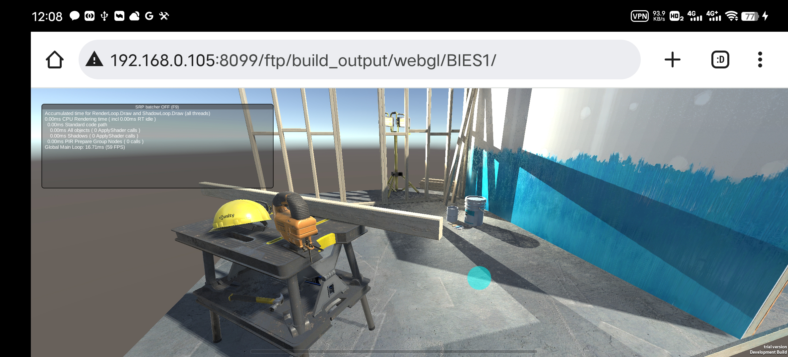
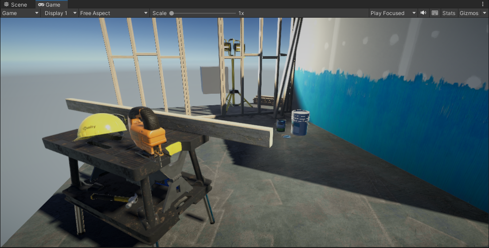
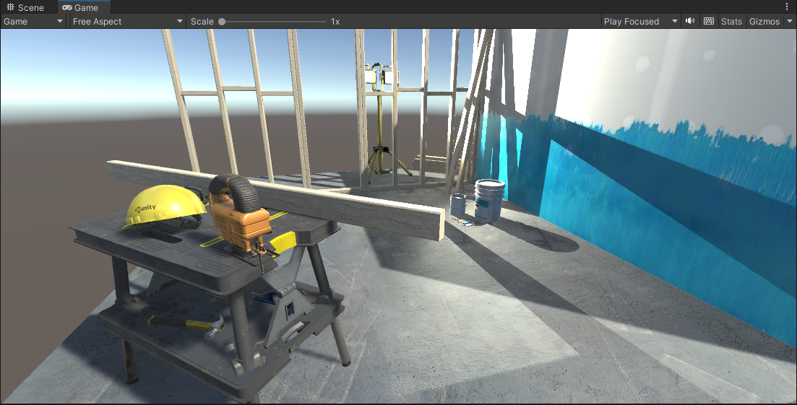

# Purpose
To research Build-in pipeline effect and performance.

# Environment
Same as in *UnityWebGLRender.md*
Create a new project in 3D (Build-in).
Project: *BuildinRenderTest*

# WebGL
Test on Android.

## 1.0

## 2.0

* 2.0 can use High Quality of *Lightmap Encoding*.

# Build-in VS SRP
## Effect
Build-in:
* Lost Light Probe Group.
* Lost Post-Processing Volume.
* Different lighting model.
    
    

## Performance
Build-in will loss:
* Lost SRP & Batcher.
* Reduce number of lights.

