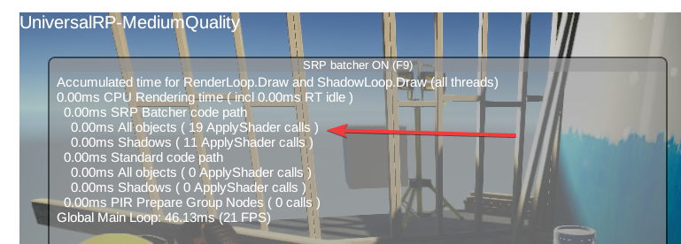
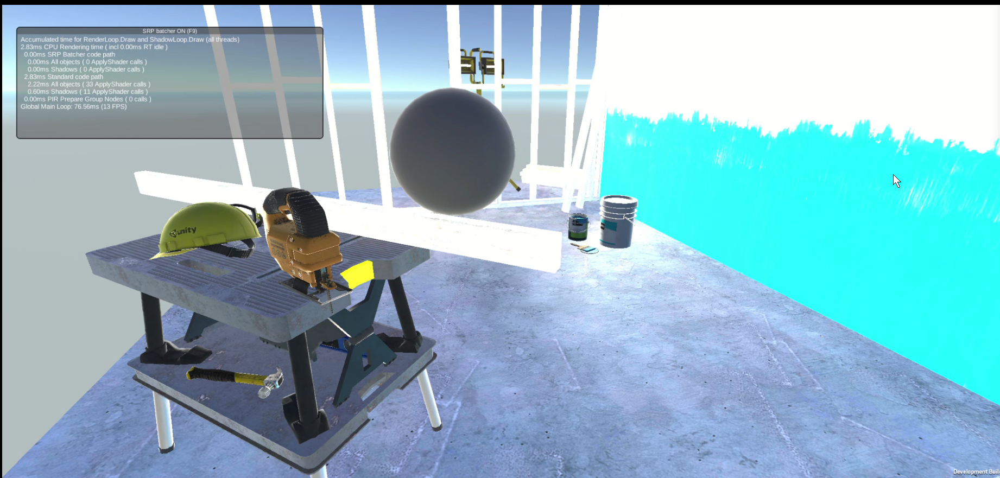
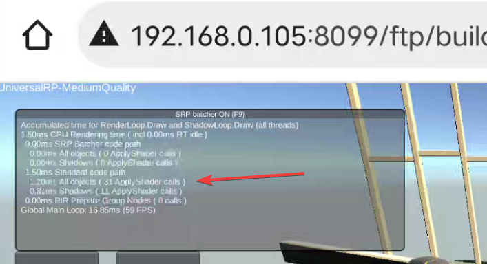
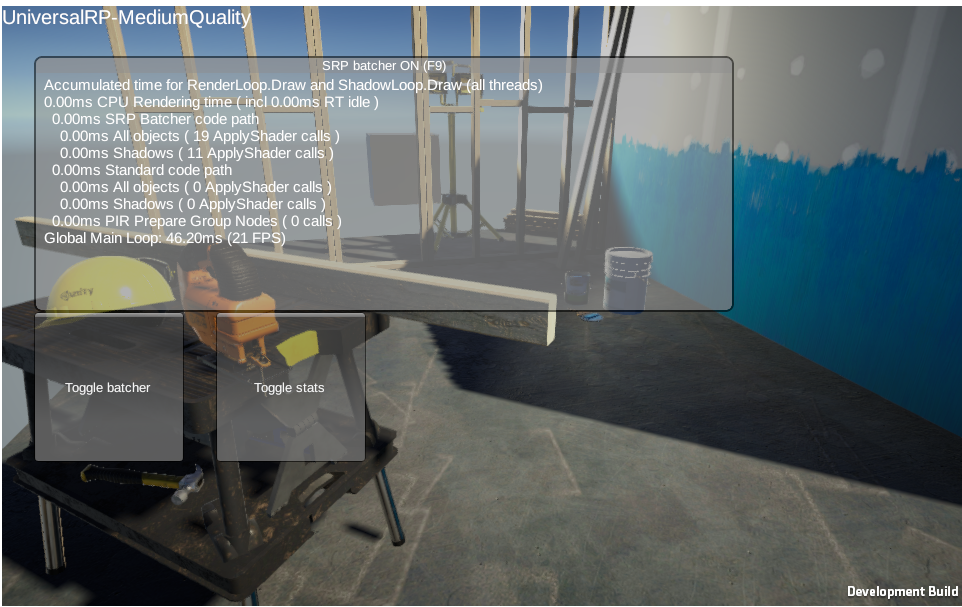
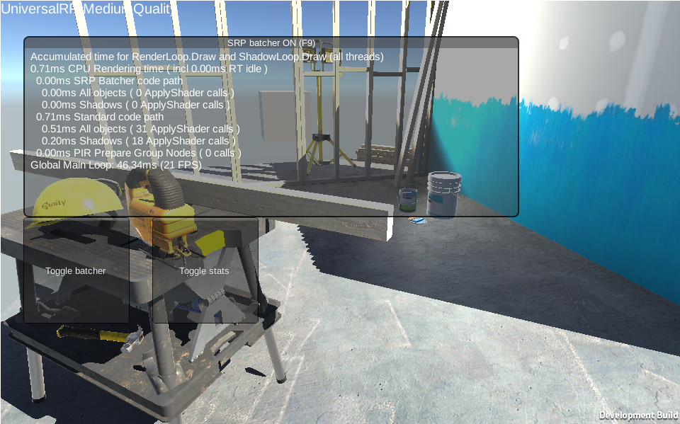

# Purpose
To research SRP working on different platform.

# Environment
Same as in *UnityWebGLRender.md*
Project: *UrpRenderTest*

# SRP Batcher (Is it enable?)

## Android
* Enabled on default setting.

| Graphics API | SRP Batcher |
| :----------: | :---------: |
|  OpenGL ES3  |      Y      |
|  OpenGL ES2  |      N      |
|    Vulkan    |      Y      |

* OpenGL ES2 (Android).
    
    
## iOS
**Wait to test?**

## WebGL

| WebGL | Platform | Safari | Chrome | 
| :---- | :------: | :----: | :----: |
| 1.0   |   iOS    |   N    |   N    |
|       | Android  |   NA   |   N    |
|       |    PC    |   NA   |   N    |
| 2.0   |   iOS    |   Y    |   Y    |
|       | Android  |   NA   |   Y    |
|       |    PC    |   NA   |   Y    |

* But FPS is very slow in WebGL 2.0 in iOS.

# SRP Fallback
* SRP working
    
* SRP not work
    
    * Lost Post-processing.
    * PBR is keeping.

# Conclusion 
* SRP Batcher can not work in WebGL 1.0.
* SRP will be fallback in WebGL 1.0.
* SRP fallback will lost too many details in rendering result.

