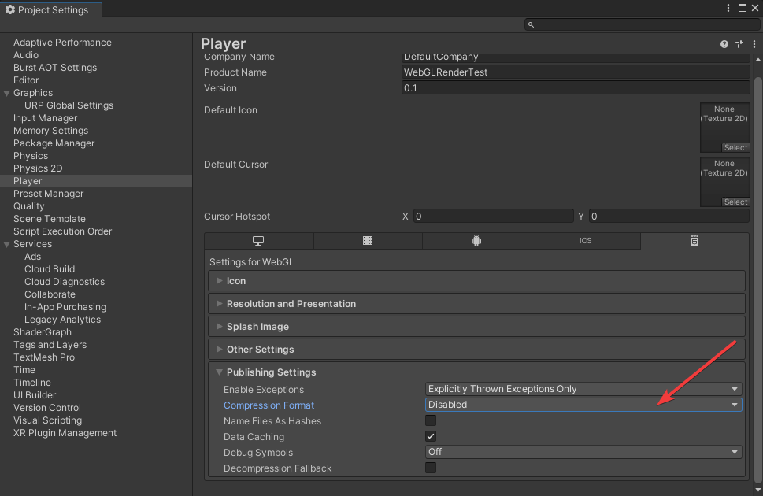

# Reference
## WebGL Browser Compatibility
* [Unity manual](https://docs.unity3d.com/2019.1/Documentation/Manual/webgl-browsercompatibility.html)
    * iOS Safari not to support WebGL2.0
* [webreport.com](https://webglreport.com/?v=1)
    * Check browser's compatibility with WebGL versions.
    * Check compatibility results:
    
        | OS      | Browser | WebGL 1.0 | WebGL 2.0 |
        | :------ | :------ | :-------: | :-------: |
        | Windows | Chrome  |     Y     |     Y     |
        | Android | Chrome  |     Y     |     Y     |
        | iOS     | Chrome  |     Y     |     Y     |
        | iOS     | Safari  |     Y     |     Y     |
    * Those result above conflict with Unity document.

# Prepare Environment
## Unity
* Create URP project
    
* Disable compression
    

## Browser Version
* Windows 10
    * Chrome, Version 107.0.5304.88 (Official Build) (64-bit)
* Android 
    * Chrome, Beta 109.0.5414.23
* iOS
    * Chrome, 108.0.5359.52
    * Safari, (iOS 15.6.1)

## Screen Size:
* PC: 960*600
* Android: 2283x672
* iOS: 2424x1074
* SRP fallback in WebGL?
    
* And incur too much Drawcall(batches)
    

## Graphics Device
[About graphicsShaderLevel](https://docs.unity3d.com/2019.1/Documentation/ScriptReference/SystemInfo-graphicsShaderLevel.html)

| System  | graphicsDeviceType |               graphicsDeviceVersion               | graphicsShaderLevel | 
| :------ | :----------------- | :-----------------------------------------------: | :-----------------: |
| Windows | OpenGLES3          | OpenGL ES 3.0 (WebGL 2.0(OpenGL ES 3.0 Chromium)) |         35          |
| Android | OpenGLES3          | OpenGL ES 3.0 (WebGL 2.0(OpenGL ES 3.0 Chromium)) |         35          |
| iOS     | OpenGLES3          |             OpenGL ES 3.0 (WebGL 2.0)             |         35          |


# Test Record 
| No. | Base On |                             Changing                             | iOS FPS | Android FPS | PC FPS |                        Comment                        |
| :-- | :------ | :--------------------------------------------------------------: | :-----: | :---------: | :----: | ----------------------------------------------------- |
| 1   | 1       |                         Default Setting                          |    5    |     59      |   59   | SRP not available                                     |
| 2   | 1       |                           DXT -> ASTC                            |    5    |     59      |   59   |                                                       |
| 3   | 1       |                   Color Space: Linear -> Gamma                   |    5    |     59      |   59   |                                                       |
| 4   | 3       |                    Auto Graphics API: Enable                     |    5    |     59      |   59   | Has rebuild shaders                                   |
| 5   | 4       |                Lightmap encoding: High -> Normal                 |    5    |     59      |   59   | Wrong color on all platform                           |
| 6   | 3       |                    Graphics API: Add WebGL 1                     |    5    |     59      |   59   |                                                       |
| 7   | 6       |                   Graphics API: Remove WebGL 2                   |   31    |     59      |   59   |                                                       |
| 8   | 7       |  Turn off Example Assets. And Application.targetFrameRate = 60;  |  31/59  |     59      |   59   | Turn off and on at iOS, increase FPS 30->38           |
| 9   | 8       |                Application.targetFrameRate = 100;                |   30    |     59      |   59   | Top limited FPS on mobile is 60                       |
| 10  | 9       |  Post-process Volume: Increase parameters to enhance visibility  |   30    |     59      |   59   | Sure: Post-process Volume not available               |
| 11  | 9       |             Vsync Count: Every V Blank -> Don't Sync             |   30    |     59      |   59   |                                                       |
| 12  | 9       | Color Space: Gamma -> Linear & Graphics API: Remove WebGL 1 -> 2 |    5    |     59      |   59   | OK: Post-process Volume available. But iOS only 5 FPS |

# Comparison
* [forest](https://test.looc.io/forest/index.html)
    * Mac (lijia):
        * **[BAD]** Safari (15.6): 2~4 fps
        * Chrome: 14~18 fps
    * PC (Chrome): 
        * lijia: 60 fps 
        * wanglei: 35 fps 
    * **[BAD]** iOS (liuwei, Safari 14): 40~50 fps. But other said it is bad on Ventura 13.1.1 and Safari 16.1.1 5. [ref1](https://developer.apple.com/forums/thread/696821)  [ref2](https://developer.apple.com/forums/thread/672478)
    * Android: Unknown (Can not open)
    * Build with Unity.
* [smashkarts.io](https://smashkarts.io/)
    * Mac:
        * Chrome: 60 fps
        * Safari: **Crash**, 25~30 fps
    * iOS (xr):
        * Chrome: 30~40 fps
        * Safari: **Crash**, 27~29 fps
* Our Demo (version 11 & 12)
    * Mac (lijia):
        * Chrome: 
            * WebGL1.0: 59 fps
            * WebGL 2.0: 59 fps
        * Safari: 
            * WebGL1.0: 59 fps
            * **[BAD]** WebGL2.0: 8 fps
    * iOS (xr):
        * Chrome / Safari: 
            * WebGL1.0: 30 fps
            * **[BAD]** WebGL 2.0: 5 fps
    * iOS (8 plus)
        * Safari (14):
            * WebGL1.0: 60fps
            * WebGL2.0: Not to support.


# Conclusion
2 factions: Metal, ??
Which version update to Metal driver?
android try to use urp
add vconsole in test
check batch on webgl or render debug
control webgl in js or c# code
must combine avatar meshes

resolution:
webgl 1.0
self browser ?

## About Safari / iOS
[SAFARI 15.2 WEBGL performance disaster](https://developer.apple.com/forums/thread/696821)
* Risk: Safari update may cause new problems. Such as: should change WebGL 2.0 ->1.0.
[Frame-rate drops at game beginning on iOS safari?](https://forum.unity.com/threads/frame-rate-drops-at-game-beginning-on-ios-safari.1064447/)
```csharp
PlayerSettings.WebGL.emscriptenArgs = "-s msimd128";
BuildOptions option = BuildOptions.None;          
BuildPipeline.BuildPlayer(GetScenePaths(), "webgl", BuildTarget.WebGL, option);
```
[Removing support for GLES2 and WebGL1 in 2023.1a](https://forum.unity.com/threads/removing-support-for-gles2-and-webgl1-in-2023-1a.1360090/)
* Focus on GLES3 and WebGL 2 graphics APIs.

[Issue Track: WEBGL BAD PERFORMANCE WHEN PLAYING IN SAFARI](https://issuetracker.unity3d.com/issues/webgl-bad-performance-when-playing-in-safari)
* This is an issue with the Safari browser and its performance for WebGL being converted to Metal. We've reported the issue to Apple, and have alerted the other interested WebGL parties external to Unity, but from our side, there's nothing we can do.
[Search issue on Unity](https://unity3d.com/search?refinement=issues&gq=fps%20ios)